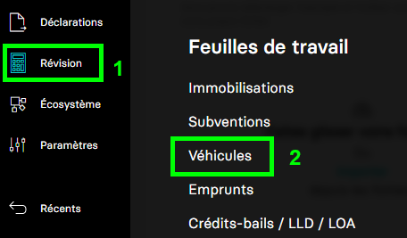
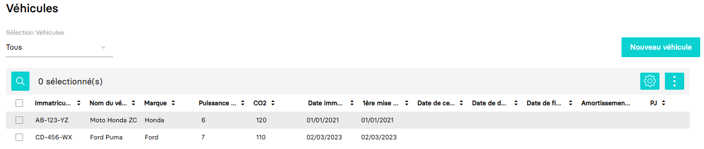

---
prev:
  text: 🐤 Introduction
  link: documentation.md
next: false
---

<span id="readme-top"></span>

# Récupérer la liste des Véhicules d'une société (dossier)

Ce guide va vous accompagner dans l'opération de récupération de la liste des véhicules d'une société (dossier).

Dans MyUnisoft les véhicules sont gérés depuis : `Révision` > `Feuille de travail` > `Véhicules`.



Vous obtenez ainsi la liste des véhicules enregistrés dans le dossier.



## API

La route https://api.myunisoft.fr/api/v1/vehicles permet de récupérer cette liste avec l'API partenaires.

```bash
curl --location 'https://api.myunisoft.fr/api/v1/vehicles?mode=1' \
--header 'X-Third-Party-Secret: nompartenaire-L8vlKfjJ5y7zwFj2J49xo53V' \
--header 'Society-id: 1' \
--header 'Authorization: Bearer {{API_TOKEN}}'
```

> [!IMPORTANT]
> Penser à préciser l'en-tête **society-id** pour préciser le dossier que vous souhaitez interroger.

L'endpoint attend les paramètres (Querry strings) suivants pour pouvoir être exécuté :

| paramètre | decription |
| --- | --- |
| `mode` | Le type de retour attendu :<br>1 = normal (Par defaut)<br>2 = pour les flags dans la page de la saisie |

<details class="details custom-block"><summary>Retour JSON de l'API</summary>

```json
[
    {
      "vehicule_id": 964,
      "use_start_date": null,
      "brand": "Honda",
      "registration_date": "2021-01-01",
      "first_registration_date": "2021-01-01",
      "rental_organization": null,
      "selling_date": null,
      "is_assigned_to_employee": false,
      "is_excess_deprecation": false,
      "immo_id": 102857,
      "use_end_date": null,
      "vehicule_name": "Moto Honda ZC",
      "registration": "AB-123-YZ",
      "pollution_rate": 120,
      "purchase_price": 20000,
      "is_owner": true,
      "fiscal_power": 6,
      "vehicule_assignment_type_id": null,
      "vehicule_type_id": 2,
      "vehicule_fuel_type_id": 2,
      "fuel": {
        "id_fuel_type": 2,
        "code": "DSL",
        "label": "Diesel"
      },
      "line_entry_origin": null,
      "flag_type": null,
      "attachment": [
        {
          "id_document": 4133288,
          "token": "faketokena228f76abcdefg077fd4385",
          "link": "https://url.du.document.com/1-faketokena228f76abcdefg077fd4385",
          "download": "https://url.du.document.com/1-faketokena228f76abcdefg077fd4385/download",
          "thumbnail": "https://url.du.document.com/1-faketokena228f76abcdefg077fd4385/preview?x=90&y=120",
          "baseURL": "https://url.stokage.com",
          "date": "2025-02-27T18:12:07",
          "name": "document"
        }
      ]
    }
    // ...
]
```

</details>

<details class="details custom-block"><summary>Interface TypeScript Véhicules</summary>

```ts
export interface Véhicule {
  vehicule_id: number,
  use_start_date: string,
  brand: string,
  registration_date: string,
  first_registration_date: string,
  rental_organization: string,
  selling_date: string,
  is_assigned_to_employee: boolean,
  is_excess_deprecation: boolean,
  immo_id: number,
  use_end_date: string,
  vehicule_name: string,
  registration: string,
  pollution_rate: number,
  purchase_price: number,
  is_owner: boolean,
  fiscal_power: number,
  vehicule_assignment_type_id: number,
  vehicule_type_id: number,
  vehicule_fuel_type_id: number,
  fuel: {
    id_fuel_type: number,
    code: string,
    label: string
  },
  line_entry_origin: number,
  flag_type: number,
  attachment: [
    {
      id_document: number,
      token: string,
      link: string,
      download: string,
      thumbnail: string,
      baseURL: string,
      date: string,
      name: string
    }
  ]
}
```

</details>

<p align="right">(<a href="#readme-top">retour en haut de page</a>)</p>
