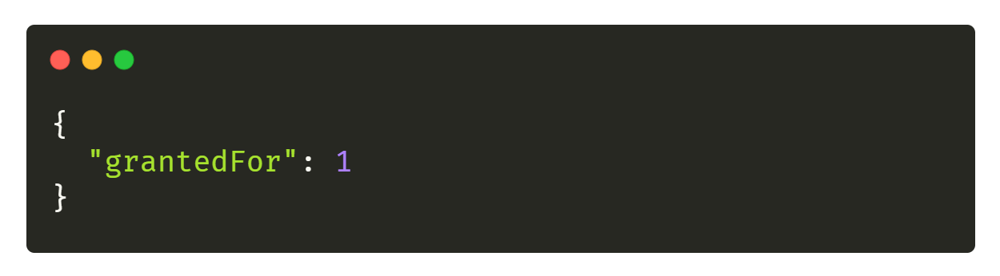

# 🔸 Authentification avec accès société

Il est nécessaire de récupérer **un jeton Utilisateur** pour pouvoir utiliser les routes décrites dans les sections ci-dessous. Nous vous invitons à suivre [le guide suivant](./user.md) pour en récupérer un.

## Récupération de l’id du partenaire (grantedFor)
Avant de pouvoir générer une clé (**API Token**) il est nécessaire de récupérer votre id partenaire à l’aide de la **clé secrète x-third-party**.

L’id récupéré peut être différent selon l’environnement (production, staging et dev) et  il sera utilisé en tant que clé `grantedFor` pour la génération de l’API Token dans la prochaine section.

Pour récupérer l’id il vous faut requêter la route /api/v1/key/granted-for en POST avec le body JSON suivant:
```bash
$ curl --location --request POST 'https://app.myunisoft.fr/api/v1/key/granted-for' \
--header 'Authorization: Bearer {{TOKEN}}' \
--header 'Content-Type: application/json' \
--data-raw '{
    "secret": "nompartenaire-L8vlKfjJ5y7zwFj2J49xo53V"
}'
```

Si tout se passe comme  prévu vous devriez recevoir un payload comme suit avec un status code `200` (**le 1 dans le retour étant évidemment un exemple**). 


À noter qu’il n’est pas forcément nécessaire d’envoyer l’intégralité du secret. Il est aussi possible d’envoyer uniquement la première section avant le tiret du six “-”.

## Génération de la clé (API Token)

Il suffit de requêter la route **/api/v1/key/create** en POST:
```bash
$ curl --location --request POST 'https://app.myunisoft.fr/api/v1/key/create' \
--header 'Authorization: Bearer {{TOKEN}}' \
--header 'Content-Type: application/json' \
--data-raw '{
  "grantedFor": {{GRANTED_FOR}},
  "target": 1855
}
'
```

- **grantedFor**: l’id du partenaire auquel vous souhaitez avoir accès et qui sera lié à l’API Token. Récupéré dans la section précédente.
- **target**: l’id de la société qui sera lié à l’API token. Il est possible de récupérer l’id d’une société par le biais de l’application MyUnisoft (l’id sera présent dans l’URL).

Si tout se passe comme  prévu vous devriez recevoir un payload comme suit avec un status code `200`. 


La clé value est un jeton [JWT](https://jwt.io/) que vous allez devoir utiliser pour requêter les routes exposées par l’API. Nous parlerons “d’API Token” quand il est question de l’utilisation de celui-ci (A ne pas confondre avec le jeton Utilisateur).

À noter qu’une fois votre API token généré il n’est plus nécessaire de refaire les étapes ci-dessus (sauf si le token a entre-temps été revoqué).

