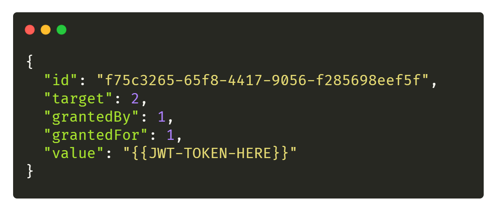

# 🔸 Authentification avec accès société

Pour commencer, il est nécessaire de récupérer **un jeton Utilisateur**. Nous vous invitons à suivre [le guide suivant](./user.md) pour en récupérer un.

## Génération de la clé (API Token)

Il suffit de requêter la route `/api/v1/key/create` avec la méthode **POST**:
```bash
$ curl --location --request POST 'https://app.myunisoft.fr/api/v1/key/create' \
--header 'Authorization: Bearer {{ TOKEN }}' \
--header 'X-Third-Party-Secret: {{ X-Third-Party-Secret }}' \
--header 'Content-Type: application/json' \
--data-raw '{
  "target": 1855
}
'
```

- **target**: l’id de la société qui sera lié à l’API token. Il est possible de récupérer l’id d’une société par le biais de l’application MyUnisoft (l’id sera présent dans l’URL).

Si tout se passe comme  prévu vous devriez recevoir un payload comme suit avec un status code `200`. 

<p align="center">

</p>

La clé value est un jeton [JWT](https://jwt.io/) que vous allez devoir utiliser pour requêter les routes exposées par l’API. Nous parlerons “d’API Token” quand il est question de l’utilisation de celui-ci (A ne pas confondre avec le jeton Utilisateur).

À noter qu’une fois votre API token généré il n’est plus nécessaire de refaire les étapes ci-dessus (sauf si le token a entre-temps été revoqué).

