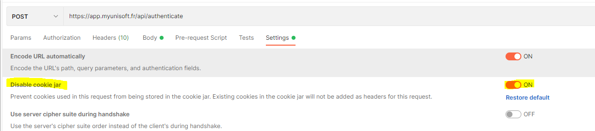

# Authentification utilisateur

Pour pouvoir créer un jeton (API Token) il est nécessaire de s'authentifier auprès de notre service authentification. Un compte vous sera créé au sein d'un schéma dédié aux tests avec nos différents partenaires.

## Récupération d’un jeton sur le Service auth

Les routes de l’API partenaires commençant par **/key** demandent toutes une en-tête http **Authorization** avec un **Bearer token** (l'access token). Nous parlerons de ce token comme étant le “**User token**”.

La route (racine) pour la requête http est POST **/api/authenticate**. Le body (JSON) de la requête pour l’authentification:
```json
{
    "mail": "{{mail}}",
    "password": "{{password}}"
}
```

Les champs “**password**” et “**mail**” doivent être complétés avec le compte qui vous a été fourni.

> Si vous utilisez Postman, faites attention à désactiver l'utilisation des cookies.


---

Vous devriez recevoir un status code `200` avec un JSON contenant la fameuse clé JWT “**access_token**”.
```json
{
    "status": "authenticated",
    "policy": "OAuth2",
    "firm": { "id": "1", "label": "TESTS PARTENAIRES" },
    "details": {
        "expire_in": "2021-04-13 10:41:01",
        "access_token": "{{ACCESS_TOKEN}}",
        "refresh_token": "{{REFRESH_TOKEN}}",
        "token_type": "bearer"
    }
}
```

---

⬅️ [🔸 Authentification avec accès société](./societe.md)
