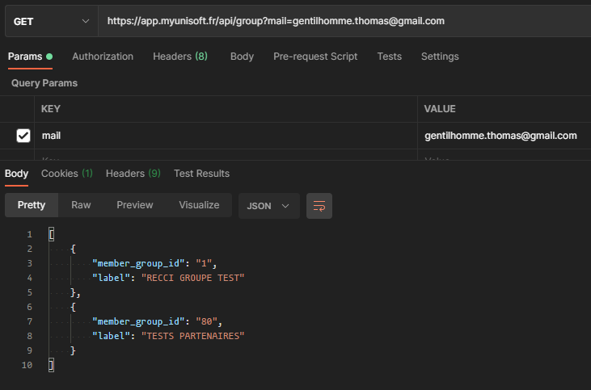

# Authentification utilisateur

Pour pouvoir créer un jeton (API Token) il est nécessaire de s'authentifier auprès de notre service authentification. Un compte vous sera créé au sein d'un schéma dédié aux tests avec nos différents partenaires.

## Récupération du member_group_id
Pour pouvoir authentifier un compte il est préalablement nécessaire de connaître son ou ses groupes d’appartenances (ce qui correspond à la clé “**member_group_id**”).

Pour récupérer ces informations il suffit d’envoyer une requête HTTP GET sur la route suivante: **/api/group?mail=email-du-compte**



En ce qui vous concerne vous devriez n’avoir qu’un seul résultat dans le retour.

## Récupération d’un jeton OAuth2 sur le Service auth

La première étape consiste à s’authentifier sur le service d'authentification. Les routes de l’API partenaires commençant par **/key** demandent toutes un header **Authorization** avec un **Bearer token** (l'access token).

Nous parlerons de ce token comme étant le “**User token**”. La route (racine) pour la requête http est **/api/auth/token**.

Body (JSON) de la requête POST pour l’authentification:
```json
{
    "member_group_id": 80,
    "password": "{{password}}",
    "mail": "{{mail}}",
    "grant_type": "password"
}
```

Les champs “**password**” et “**mail**” doivent être complétés avec le compte qui vous a été fourni. La clé “**member_group_id**” doit être récupérée dans la section précédente!

---

Vous devriez recevoir un status code `200` avec un JSON contenant la fameuse clé JWT “**access_token**”.
```json
{
  "expire_in": "2020-10-14 19:00:25",
  "access_token": "{{USER_TOKEN_HERE}}",
  "refresh_token": "{{REFRESH_TOKEN}}",
  "token_type": "bearer"
}
```