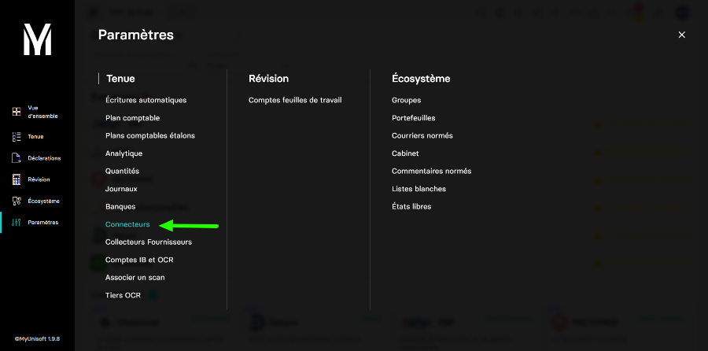
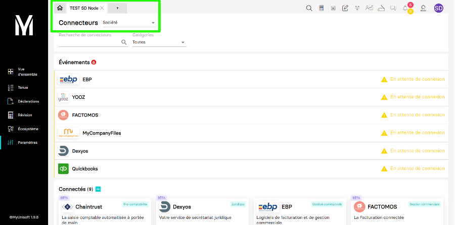
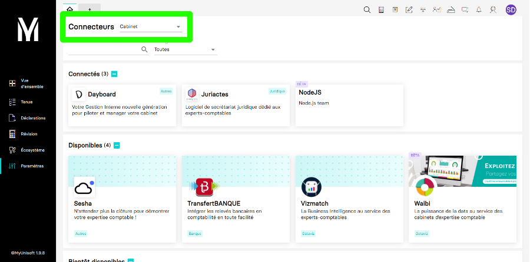
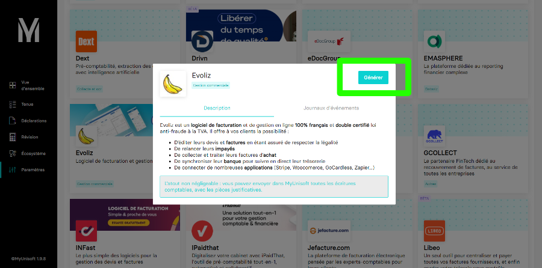
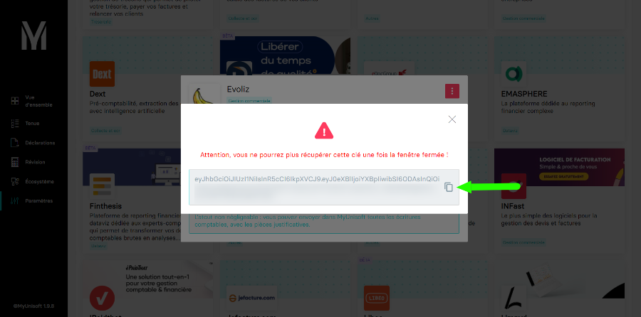
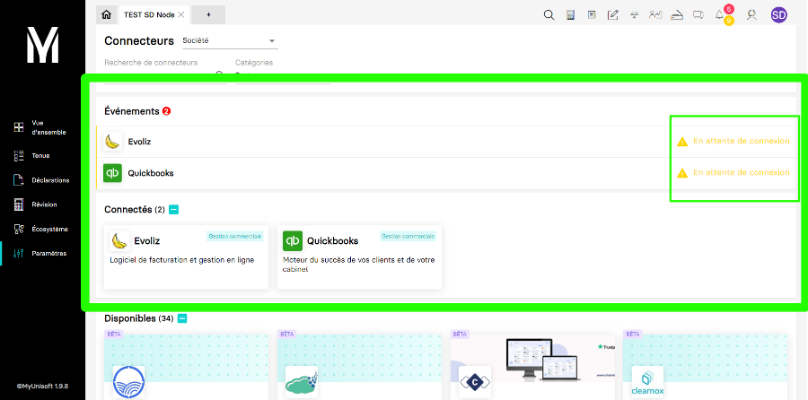
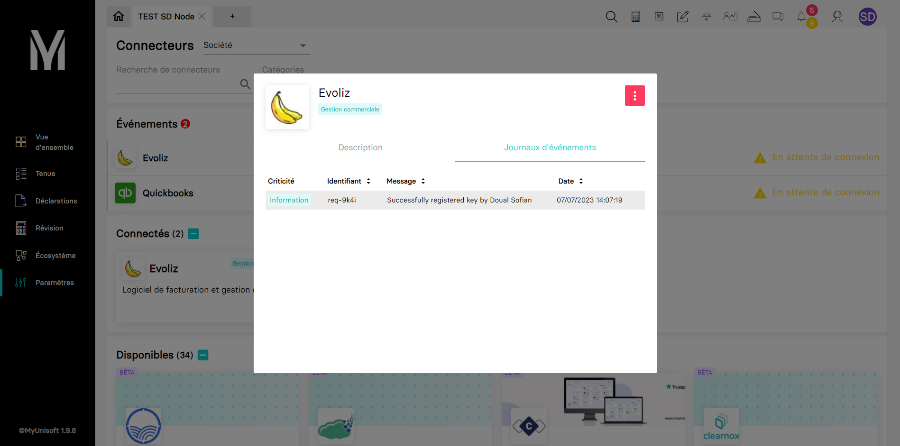
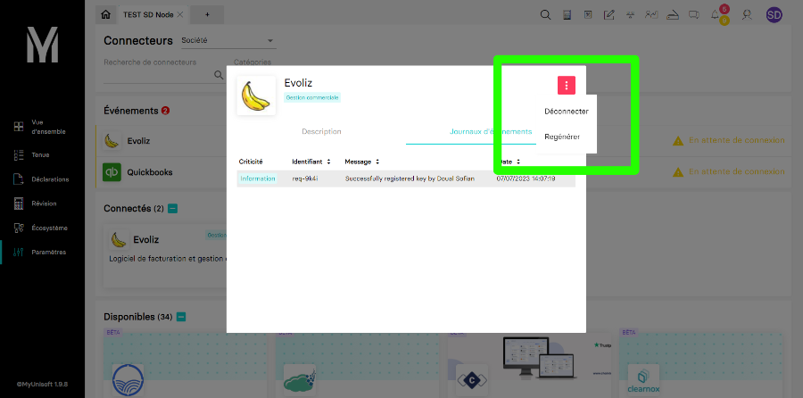

---
prev:
  text: 🐤 Introduction
  link: documentation.md
next: false
---

<span id="readme-top"></span>

# Authentification

La consommation de l'api partenaire requiert une clé [JWT](https://jwt.io/) valide ainsi qu'une clé secrète `X-Third-Party-Secret`.

Les clés se gèrent depuis les pages **Connecteurs dossier** ou **Connecteurs cabinet** (suivant votre type d'accès) dans l'application MyUnisoft: `Paramètres` > `Connecteurs dossier` ou `Connecteurs cabinet`.



## Type d'accès

- 🔸 **Accès Société**:

L'accès de niveau société vous donne accès à un unique dossier.

Faites attention a bien sélectionner la société ciblée pour créer ce type de token.



- 🔹 **Accès Cabinet**:

L'accès de niveau cabinet vous donne accès à la totalité des dossiers contenu dans un schéma (cabinet).

Faites attention a bien sélectionner le mode `Cabinet`.



## Génération d'une clé

1. **Sélection du partenaire** : Vous devez sélectionner la carte correspondante au partenaire avec lequel vous désirez établir une liaison. Cliquez maintenant sur ladite carte.

2. **Création de la clé** : Cliquez sur le bouton `Générer` pour créer un clé.

> [!CAUTION]
> Assurez-vous de bien copier la clé avant de fermer la fenêtre sans quoi vous serez obliger de générer une nouvelle clé.





> [!TIP]
> Une fois votre clé générée il n’est plus nécessaire de refaire les étapes ci-dessus sauf si la clé a entre-temps été **déconnecté**.

## État d'une clé

Une fois la clé créée, vous verrez apparaitre une carte dans la section `Connectés` ainsi qu'une ligne dans la section `Évènements`.

Sur cette ligne, vous devriez voir la mention `En attente de connexion`. Ce message disparaitra dès que la clé sera activée ou utilisée.

> [!IMPORTANT]
> Pour activer une clé, il vous faut appeler l'url `https://api.myunisoft.fr/api/v1/key/info?mode=extended`.
>
> [Guide sur les endpoints accessibles](../endpoints/keyinfo.md).



## Évènements liés à une clé

Il vous est possible de consulter un journal d'évènement lié à une clé.

Un évènement est une notification avec un statut (Error, Warning, Info) contenant certaines informations, l'id de la requête ainsi que la date.

Pour consulter ce journal d'évènement, cliquez sur la carte partenaire dans la section `Connectés`, une fenêtre s'ouvre alors. Maintenant cliquez sur l'onglet `Journaux d'évènements`, vous devriez voir une liste contenant les informations citées plus tôt.



## Déconnexion d'une clé

Pour supprimer une clé, cliquez sur la carte partenaire dans la section `Connectés`, une fenêtre s'ouvre alors. Maintenant cliquez sur le bouton rouge en haut à droite et enfin cliquez sur `Déconnecter`.



## Erreur

Dans le cas où la clé n'existe pas ou alors que cette dernière a été déconnecté/révoqué, vous devriez recevoir cette erreur:

```json
{
  "error": {
    "code": "ERR-API-TOKEN-NOT-FOUND",
    "message": "Unable to found the token in the DB. The token has certainly expired or been revoked.",
    "details": {
      "url": "https://api.myunisoft.fr/api/v1/society",
      "method": "GET",
      "requestedAt": "07 Jul 2023, 17:58:18",
      "requestId": "req-44b440f90368471d"
    }
  }
}
```

Dans ce cas, il vous faut simplement générer une nouvellle clé.

Si le problème persiste malgré ça, contactez nos équipes techniques.
