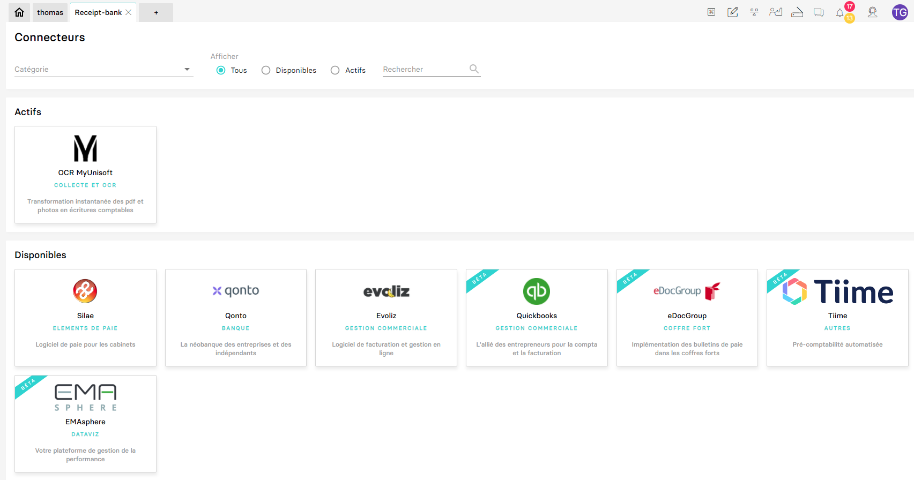
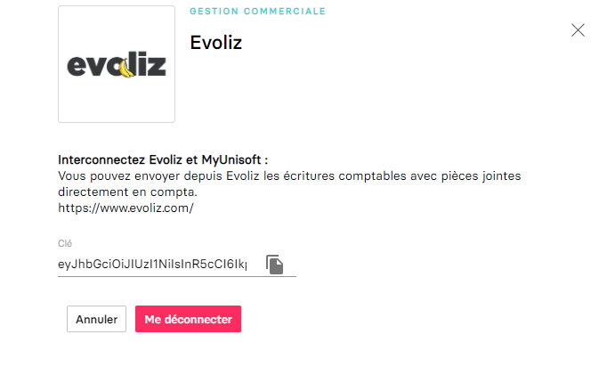

# Connecteurs

Les connecteurs sont des abstractions qui permettent d'interconnecter MyUnisoft avec d'autres solutions (par le biais d'implémentations techniques diverses et variées selon les contraintes et besoins de chacun).

L'API partenaires offre la possibilité à nos partenaires (ainsi que les cabinets utilisant déjà la solution) de s'interconnecter eux-mêmes avec MyUnisoft par le biais d'une API Gateway qui s'occupera de dispatcher les demandes à nos micros-services internes (pour récupérer ou envoyer des informations d'une société ou d'un cabinet entier).

Le gestionnaire (comptable et autres) d'un dossier aura plus tard la possibilité de gérer lui-même les outils qu'il souhaitera utiliser (dans le cadre d'un accès par société). Les différents connecteurs sont disponibles dans `Paramètres` > `Tenue` > `Connecteur (Silea, RCA...)`

Lors d'un clic sur un des connecteurs un pop-up s'ouvrira. Elle va permettre de générer une clé (API Token) que le comptable pourra renseigner dans votre solution.

## Exemple avec Evoliz

Pour mieux comprendre je vous invite à [visionner la vidéo de notre partenaire Evoliz](https://vimeo.com/432178505/b1a518283f) sûr comment connecter MyUnisoft avec leur solution.

## Pourquoi

Il pourrait être tentant d'essayer de s'interconnecter à MyUnisoft en exploitant directement nos API comme le ferait nos frontaux. Mais laissez-nous vous expliquer pourquoi ce serait une terrible erreur:

- Le modèle d'authentification est conçu pour un Utilisateur (une personne physique). Établir une utilisation non identifiée et non autorisée aura probablement comme conséquence de compromettre la sécurité des comptes que vous exploitez.
- Vous n'avez aucune garantie que les endpoints HTTP seront demain toujours accessible et identique (Il vous sera donc impossible de vous plaindre à MyUnisoft en cas d'impact).
- Ce ne sont pas les mêmes garanties en termes de sécurité, monitoring et support.