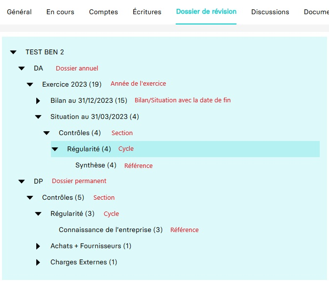

<script setup>
  import Carousel from '../components/carousel.vue'
</script>

# 📂 Parcours d'intégration GED

Ce guide s'adresse aux éditeurs de gestion électronique de documents (GED) souhaitant s'intégrer avec MyUnisoft pour gérer les documents de nos collaborateurs.

La GED intégrée à MyUnisoft offre une organisation divisée en plusieurs onglets :

- **Général** : Regroupe l'ensemble des fichiers disponibles dans la GED.  

- **En cours** : Centralise les documents récemment analysés par l’OCR.

- **Comptes** : Stocke les documents spécifiques associés aux différents comptes comptables.

- **Écritures** : Inclus les pièces justificatives associées aux écritures comptables.

- **Dossier de révision** : Regroupe les documents liés à la révision comptable.

- **Discussion** : Contient les documents liés aux discussions entre collaborateurs.

- **Documents partagés** : Une zone où le client peut déposer et consulter des fichiers

- **Documents externes** : <a id="externalDocuments"></a>Regroupe les documents transmis via l'API partenaire GED. Cet onglet n’est pas directement accessible. Pour en savoir plus, consultez la section [Nous envoyer un document](#upload).

## 🔬 Aperçu de l'usage classique

La plupart des éditeurs de GED souhaitent :

1. Être informés de la création d’un document dans MyUnisoft.
2. Obtenir les informations liées aux documents (métadonnées, détails sur le dossier comptable, etc.).
3. Télécharger des fichiers.
4. Envoyer des fichiers.

::: info
Actuellement, l'API partenaires de la GED se limite à la gestion des éléments du dossier de révision et des documents partagés.
:::

## 📑 Arborescence

#### Documents partagés
L’arborescence des documents partagés est entièrement personnalisée par le client. Elle se compose uniquement de dossiers et sous-dossiers créés selon les besoins spécifiques du client, offrant ainsi une structure adaptée à son utilisation.

Si le dossier \_\_OLD__ est présent, cela signifie que le cabinet a propagé l’arborescence configurée au niveau cabinet à l’ensemble des dossiers comptables. Lors de cette propagation, si des documents étaient déjà présents dans l’onglet Documents partagés, ils sont automatiquement déplacés dans le dossier \_\_OLD__ pour éviter toute perte de données.

#### Dossier de révision
Pour le dossier de révision, vous pouvez vous référer à l'image ci-dessous pour mieux comprendre son organisation et son contenu.



## 🔀 Webhooks

> [!IMPORTANT]
> Les évènements liés aux documents sont actuellement déclenchés uniquement lors de la **_création_** d’un document dans le dossier de révision ou les documents partagés

> [!TIP]
> Pour plus d'informations sur les **webhooks**, vous pouvez consulter [ce guide](../webhooks.md)

Vous pouvez effectuer les actions suivantes pour déclencher des évènements liés aux webhooks :

##### Via l'application
::: details Documents partagés
Pour déclencher un événement lors de la création d’un document dans la section `Documents partagés`, suivez ces étapes :

1. Sélectionnez un dossier comptable.

2. Accédez à `Tenue > GED`.

3. Ouvrez la section `Documents partagés`.

4. Choisissez un dossier, puis cliquez sur `Ajouter un fichier` pour importer un document depuis votre appareil local. 

Une fois le document visible dans la liste, l'événement de création de document est déclenché. Si un webhook est configuré pour cette action, il sera automatiquement exécuté.
<Carousel :includes='["shared_documents"]' :excludes='["4_bis"]'/>
:::

::: details Dossier de révision
Pour déclencher un événement lors de la création d’un document dans le `dossier de révision`, suivez ces étapes :

1. Sélectionnez un dossier comptable.

2. Accédez à `Révision > Dossier de révision`.

3. Ouvrez la section `Achats + Fournisseurs > Programme de travail`.

4. Cliquer sur la coche `+` d'une des lignes dans le tableau (en exemple `Factures non Parvenues (FNP)`).

5. Cliquer sur le trombone pour importer un document.

Une fois ces opérations terminées, l'événement de création de document est déclenché. Si un webhook est configuré pour cette action, il sera automatiquement exécuté.

> [!NOTE]
> Cet exemple n’est pas le seul moyen de déclencher des événements dans le dossier de révision. Vous pouvez également utiliser les autres onglets pour importer des documents, ce qui générera des événements. De plus, chaque fois qu’un document lié au dossier de révision est créé dans l’application, un événement sera automatiquement déclenché.
<Carousel :includes='["revision_folder"]' :excludes='["4_bis"]'/>
:::

##### Via l'API GED

Lors de l'upload d'un document via notre API GED, les webhooks seront utilisés. Voir la documentation [Nous envoyer un document](#upload) ci dessous.

## 🌍 API

L’API GED est mise à disposition de nos partenaires pour leur permettre d’interagir avec les documents.

### 🧾 Obtenir des informations sur un document

Vous pouvez interagir avec l'API pour récupérer des informations sur un document en utilisant son identifiant. Pour plus de détails sur l’utilisation de cet endpoint, veuillez consulter notre [documentation Postman](https://docs.api.myunisoft.fr/#fa193f93-62e7-4b68-93c7-40b4dfa4cbd0).

En réponse, l’API renverra un objet JSON structuré selon le typage suivant :
```ts
interface Document {
  accountingFirm: {
    id: string;
  },
  revisionFolder: {
    type: string;
    endDate: string;
  },
  accountingFolder: {
    activity: string;
    apeCode: string;
    charteredAccountant: string;
    companyType: string;
    headOfFolder: string
    id: string;
    legalFormCode: string;
    manager: string;
    name: string;
    reference: string;
    siret: string;
  };
  schema: {
    id: string;
  };
  createdAt: string;
  id: string;
  kind: string;
  name: string;
  folderPath: string[];
  uploadedBy: string;
  uuid: string;
}
```

Plus de précisions sur les propriétés :  

| Propriété | Détails |
|-----------|---------|
| `kind` | Peut prendre les valeurs suivantes : `AF`, `PF`, `DB`, `ED`, qui correspondent respectivement aux acronymes de **AnnualFolder**, **PermanentFolder**, **DocumentaryBase**, et **ExternalDocument**. |
| `folderPath` | Représente le chemin du fichier/dossier sous forme de tableau. Par exemple, pour un document du dossier de révision : `PF/Contrôles/Régularité/Fiscal/modele-facture-fr-moderne-rouge-750px.png`. |
| `revisionFolder` | Cette propriété est uniquement disponible lorsque le document provient du dossier de révision. |
| `id` | Ces propriétés sont des `integer` et son l'identifiant unique côté MyUnisoft. |
| `uuid` | Un [identifiant unique universel version 5](https://fr.wikipedia.org/wiki/Universally_unique_identifier) pouvant être utilisé par nos partenaires. |

> [!IMPORTANT]
> Les fichiers du dossier de révision suivent principalement des patterns de nommage détaillés [ici](https://myunisoft.atlassian.net/wiki/external/MGM3ZGMyZWEzZTYxNDNiMjg2YmIzYjQ0MTI4NTk5Njc).
> Ces noms de fichier se retrouveront dans la propriété `folderPath`.

### 📂 Obtenir des informations sur un ou plusieurs documents
Cet endpoint fonctionne de manière similaire au précédent, mais il permet de récupérer des informations sur plusieurs documents en envoyant des paramètres dans la requête. La réponse sera un tableau d'objets, chacun ayant la même structure que celle décrite dans la section `Obtenir des informations sur un document`.

Les paramètres `from` et `to` permettent de spécifier une plage de temps, indiquant à l'API de rechercher tous les documents créés dans MyUnisoft au cours de cette période. Le filtre est appliqué sur la date de création des documents.

Pour l'utiliser, vous pouvez consulter notre [documentation Postman](https://docs.api.myunisoft.fr/#e4150391-9401-4be2-b0c8-381e695d3d17).

### 🖨️ Télécharger un fichier.
Cet endpoint permet de télécharger un fichier.

Pour l'utiliser, vous pouvez consulter notre [documentation Postman](https://docs.api.myunisoft.fr/#1b4f5b33-f0a9-488c-8118-1f618cc4035a).

### 📨 Nous envoyer un document <a id="upload"></a>
Cet endpoint permet d'upload un document sur MyUnisoft. 

Une fois téléchargé, le document est placé dans les [Document externes](#📁-ged), **et il revient au client de classer les documents via l'application MyUnisoft.**

Voici un aperçu des deux cas d'utilisations à suivre pour ajouter un document depuis la banette des documents externes vers le dossier de révision ou les documents partagés :
> [!IMPORTANT]
> Avant d'utiliser la banette des documents externes, il est nécessaire d'upload un document via l'API GED. Si ce n'est pas déjà fait, veuillez consulter notre [documentation Postman](https://docs.api.myunisoft.fr/#658c0421-b442-4373-895c-539dc1bd486f) pour les instructions détaillées.  

> [!TIP]
> Lorsqu'un document est upload dans un dossier comptable via l'API GED, une notification sera envoyée pour informer le(s) client(s) de la disponibilité du document à classer.

> [!NOTE]
> Lorsqu'un document à classer est déplacé dans le dossier de révision ou les documents partagés, aucun événement n'est déclenché.

::: details Document partagés
<Carousel :includes='["shared_documents"]' :excludes='["4\\."]'/>
:::

::: details Dossier de révision
<Carousel :includes='["revision_folder"]' :excludes='["4\\."]'/>
:::

## 🙏 Retour d'expérience

Merci d'avoir pris le temps de parcourir ce guide dédié aux éditeurs de GED. Nous espérons qu'il vous a été utile dans votre intégration avec MyUnisoft.  

Si vous avez trouvé ce guide pertinent ou si vous avez des suggestions pour l'améliorer, n'hésitez pas à nous partager vos retours. Chaque commentaire est précieux et nous aide à mieux répondre à vos besoins.
