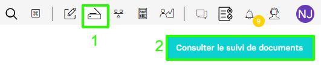
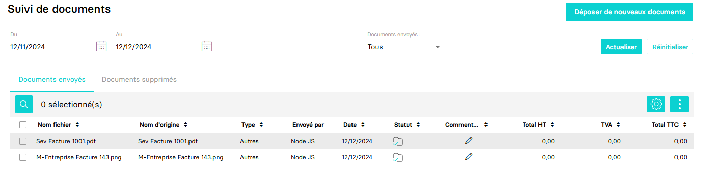

---
prev:
  text: 🐤 Introduction
  link: documentation.md
next: false
---

# Envoyer des documents divers

Ce guide a pour objectif de vous aider à envoyer des documents divers à un dossier comptable.

Qu'est ce qu'un document divers ? Il s'agit d'un document complètement indépendant et détaché d'une écriture, pouvant être de nature variée (ex: Relevé de comptes tiers).

Dans l'application MyUnisoft, ces documents sont accessibles après avoir sélectionné un dossier comptable par le bouton "Déposer de nouveaux documents" puis "Consulter le suivi de document" comme illustré ci - dessous :



Vous obtenez ainsi l'ensemble des documents divers déposés sur le dossier.



> [!NOTE]
> Vous pouvez obtenir un aperçu des documents en cliquant dessus.

## API

La route <https://api.myunisoft.fr/api/v1/variousDocuments> vous permet d'envoyer des documents divers.

```bash
curl --location 'https://api.myunisoft.fr/api/v1/variousDocuments?name=extrait-de-compte.png' \
--header 'society-id: 30210' \
--header 'X-Third-Party-Secret: {{X-Third-Party-Secret}}' \
--header 'Authorization: Bearer {{API_TOKEN}}' \
--form 'file=@"/C:/Documents/Extrait_de_compte.png"'
```

Le paramètre (URL) de la route est le suivant :

| clé | description | formats supportés | taille maximale |
| --- | --- | --- | --- |
| name | Le nom du fichier et son extension | - Documents **(.doc, .docx, .pdf)**<br>- Tableurs **(.xls, .xlsx)**<br>- Présentations **(.ppt, .pptx)**<br>- Images **(.jpeg, .jpg, .gif, .png, .bmp, .tif, .tiff, .heic, .heif)** | **15 Mégaoctets (15Mo)** |
| pers_physique_id | l'identifiant de l'utilisateur | N/A | N/A |

<details class="details custom-block"><summary>Retour JSON de l'API</summary>

```json
{
  "message_id": "9424",
  "is_updated": false,
  "created_at": "2024-12-12T13:41:38.531Z",
  "updated_at": "2024-12-12T14:41:38.527Z",
  "body": "Ajout document Autres depuis envoi divers",
  "user": {
    "user_id": -301,
    "nom": "DURANT",
    "prenom": "Antoine",
    "avatar": "https://www.gravatar.com/avatar/17630ec4e8bfddd47d27616d861a5c69?d=404"
  },
  "tags": [],
  "reactions": [],
  "documents": [
      {
        "url": "https://app.prodcomptable.myunisoft.fr/api/ged/ged/document/1-24ddf9d8b2eb6895e9915c2dd825c73d/download",
        "link": "https://app.prodcomptable.myunisoft.fr/api/ged/ged/document/1-24ddf9d8b2eb6895e9915c2dd825c73d",
        "size": 7,
        "baseUrl": "https://4.mycloud.myunisoft.fr",
        "libelle": "document.png",
        "download": "https://app.prodcomptable.myunisoft.fr/api/ged/ged/document/1-24ddf9d8b2eb6895e9915c2dd825c73d/download",
        "thumbnail": "https://app.prodcomptable.myunisoft.fr/api/ged/ged/document/1-24ddf9d8b2eb6895e9915c2dd825c73d/preview?x=90&y=120",
        "id_document": 4125602,
        "nom_original": "document.png",
        "download_link": "https://app.prodcomptable.myunisoft.fr/api/ged/ged/document/1-24ddf9d8b2eb6895e9915c2dd825c73d/download",
        "date_heure_creation": "2024-12-12T13:41:38.552"
      }
  ]
}
```

</details>

<p align="right">(<a href="#readme-top">retour en haut de page</a>)</p>
