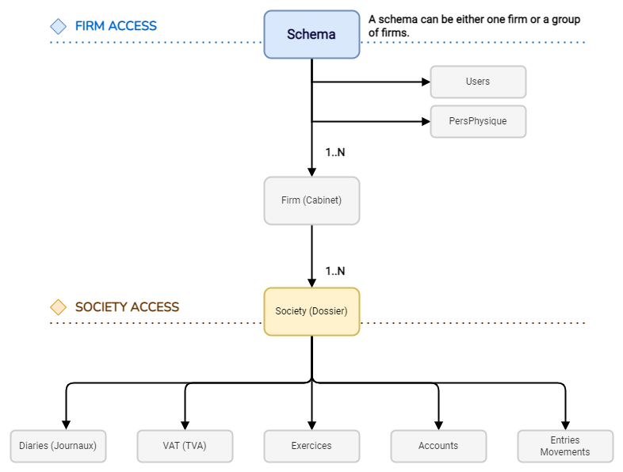

<span id="readme-top"></span>

L’API Partenaires permet aux logiciels partenaires ainsi qu'aux cabinets membres de récupérer et d'envoyer des informations depuis et vers MyUnisoft.

L’authentification du partenaire ou du cabinet est principalement basée sur :
- une clé <kbd>X-Third-Party</kbd> : fournie par MyUnisoft, à inclure dans l'en-tête HTTP de chaque requête. Cette clé `unique` ne doit surtout **pas être communiquée** en dehors de nos équipes techniques respectives.
- une clé [JWT](https://jwt.io/) (**API Token**) : propre à chaque cabinet et/ou société.

> [!IMPORTANT] 
> Ces deux clés sont nécessaires pour pouvoir utiliser les routes définies sur la documentation postman: [https://docs.api.myunisoft.fr/](https://docs.api.myunisoft.fr/)

## 👀 Prérequis

<details class="details custom-block">
<summary>✏️ Les éléments et informations à fournir</summary>

- nom partenaire.
- description courte partenaire (3 lignes 25 char maximum).
- description longue.
- logo partenaire (png, hauteur 50px).
- texte complémentaire (par exemple ou coller la clé sur votre interface ou lien vers une doc/vidéo d’utilisation avec myunisoft)
- nom, prénom, email pour un accès à myunisoft.
- nom, prénom, email pour une invitation slack/teams.
</details>
<details class="details custom-block">
<summary>👉 Ce que nous renvoyons une fois les éléments ci-dessus en notre possession</summary>

- Clé <kbd>X-Third-Party</kbd> (C’est une clé secrète unique entre vous et nous qui sera nécessaire pour requêter l’API).
- Un compte au sein d'un schéma (cabinet) dédié aux tests d'intégration.
- Lien vers la documentation **postman** ([https://docs.api.myunisoft.fr/#intro](https://docs.api.myunisoft.fr/#intro)).
</details>

N'attendez pas pour rejoindre l'écosystème [MyUnisoft connected](https://myunisoft-connected.fr/) riche de plus d'une centaine d'intégrations!

### Activation de la clé secrète X-Third-Party

Vous n'avez rien à faire pour activer cette clé. Ce sont les équipes de MyUnisoft qui s'occupent de la générer et de l'activer (c'est-à-dire la rendre valide vis-à-vis de l'API Partenaires).

> [!NOTE]  
> Il peut y avoir un certain délai entre la génération de la clé et son activation. La clé ne sera pas reconnue par notre API tant qu'elle n'aura pas été activée !

## 🔬 Type d'accès

Notre API partenaires propose deux types distincts d'accès. Chacun permet d'interconnecter nos solutions de manière permanente via un jeton sans date d'expiration (il peut néanmoins être révoqué par le gestionnaire du dossier/cabinet ou par nos équipes techniques).

Il vous sera nécessaire de choisir l'un des deux types d'accès (ou de discuter plus amplement avec nous pour vous guider vers la bonne option) :

🔸 Un accès restreint a une **société** (dossier de production) d'un cabinet.

🔹 Un accès à l'intégralité d'un **cabinet**.

> [!NOTE]
> Le terme **cabinet** ou **firm** est souvent utilisé à tort pour désigner un schéma (ou tenant) dans MyUnisoft. Un schéma peut contenir un à plusieurs cabinets et représente un client signé sur le plan commercial et technique.



> [!TIP]  
> Pour récupérer la liste et le paramétrage de plusieurs dossiers, ainsi que pour accéder aux entités non liées au dossier telles que les utilisateurs et les portefeuilles, il est nécessaire d'avoir un accès de type cabinet.

<p align="right">(<a href="#readme-top">retour en haut de page</a>)</p>

## 🔐 Authentification

### Partenaire

Voici la marche à suivre concernant l'authentification si vous êtes un partenaire: [Comment s'authentifier ?](authentication/partenaire.md)

### Formule API Cabinet (destiné aux cabinets eux-mêmes).

Voici la marche à suivre concernant l'authentification si vous êtes un cabinet ayant souscrit à l'offre API Cabinet: [Comment s'authentifier ?](authentication/cabinet.md)

<p align="right">(<a href="#readme-top">retour en haut de page</a>)</p>

## 💡 A savoir

La racine de notre API partenaires est la suivante: [https://api.myunisoft.fr/api/v1](https://api.myunisoft.fr/api/v1)

Pour vérifier sa disponibilité et son bon fonctionnement vous pouvez appeler: [https://api.myunisoft.fr/api/partners/health](https://app.myunisoft.fr/api/partners/health)

---

Toutes les réponses de l'API Partenaires contiennent un ID unique afin de traquer les requêtes.
Vous trouverez cet ID dans le header `request-id`.

> [!TIP]
> N'hésitez pas à exploiter cet ID (dans vos logs par exemple). Cet info est utile lors des échanges avec le support MyUnisoft.

---

Lors de l’utilisation d’une route exposée, il est impératif d'inclure l’**API Token** en tant que [Bearer token](https://swagger.io/./specification/authentication/bearer-authentication/) dans l'en-tête HTTP **Authorization**.

De plus, vous devez ajouter l'en-tête “**X-Third-Party-Secret**” contenant la clé secrète communiqué par notre équipe.

```bash
$ curl --location
--request GET 'https://api.myunisoft.fr/api/v1/mad/exercices?version=1.0.0' \
--header 'X-Third-Party-Secret: xxx-L8vlKfjJ5y7zwFj2J49xo53V' \
--header 'Authorization: Bearer {{API_TOKEN}}'
```

Pour plus de détails, nous vous invitons à consulter les sous-documentations suivantes en fonction de la nature de votre accès :

- <a href="./endpoints/societe" class="no_underline">🔸 Usage API avec l'accès société</a>
- <a href="./endpoints/cabinet" class="no_underline">🔹 Usage API avec l'accès cabinet</a>
- <a href="./endpoints/keyinfo" class="no_underline">🔑 Liste des routes accessibles</a>
- <a href="./ratelimit" class="no_underline">🚥 Rate limiting des routes exposées</a>
- <a href="./erreurs" class="no_underline">⚠️ Gestion et compréhension des retours/codes d'erreurs</a>

## 📌 Documentation

Une liste de guides qui pourront certainement vous aider dans la réalisation de l'interconnexion avec MyUnisoft.

- [Collection + Environment postman](./postman.md)
- <Badge type="tip" text="beta" /> [Webhooks](./webhooks.md)

### Guides sur les API cabinets
- [Création et mise à jour d'un dossier de production](./accounting/firm/create_society.md)
  - [Mise à jour des paramètres comptable d'un dossier de production](./accounting/firm/society_accounting_parameters.md)
  - [Créer, mettre à jour, clôturer un exercice comptable](./accounting/firm/exercices.md)
- [Gérer les utilisateurs d'un schéma](./accounting/firm/user_create_update.md)
  - [Récupérer les utilisateurs et personnes physiques](./accounting/firm/users.md)
- [Récupérer les dossiers accessibles pour un utilisateur](./accounting/firm/dossier_accessible.md)
- [Récupérer les dossiers de productions (entreprises)](./accounting/society.md)
- [Récupérer le paramétrage comptable d'un dossier de production](accounting/firm/accounting_parameters.md)
- [Récupérer les filiales associées à une entreprise](accounting/firm/filiale_associate.md)
- [Récupérer le paramétrage plans comptables étalons](./accounting/firm/pcg_etalon.md)
- [Récupérer les portefeuilles](./accounting/firm/wallets.md)

### Guides sur les API comptabilités

- <Badge type="tip" text="beta" /> [MAD (MyUnisoft Accounting Data)](./MAD/introduction.md)
- [Récupérer et travailler avec le plan comptable](./accounting/folder/account/plan_comptable.md)
  - [Comprendre les informations diverses et complémentaires d'un compte client ou fournisseur](./accounting/folder/account/miscellaneous_and_complementary_info.md)
  - [Mise à jour de la liste de contacts d'un compte client ou fournisseur](./accounting/folder/account/update_contact.md)
  - [Mise à jour complète d'un compte client ou fournisseur](./accounting/folder/account/update.md)
- [Récupération et/ou création d'un compte](./accounting/folder/account/create.md)
- [Lettrer les mouvements d'un compte](./accounting/folder/account/lettering.md)
  - [Récupérer la prochaine valeur de lettrage d'un compte](./accounting/folder/account/next_lettering_value.md)
- [Gérer l'analytique d'une société (dossier)](./accounting/folder/analytique.md)
- [Récupération des données liées aux widgets et dashboards](./accounting/folder/dashboard.md)
- [Récupération des dossiers de révision et des modèles de dossier](./accounting/folder/dossiers_de_révision.md)
- [Récupérer la liste des immobilisations d'une société](./accounting/folder/immobilisations.md)
- [Importer des immobilisations dans une société](./accounting/folder/import/immobilisations.md)
- [Récupérer la liste des emprunts d'une société](./accounting/folder/emprunts.md)
- [Importer des emprunts dans une société](./accounting/folder/import/emprunts.md)

#### Ecritures et mouvements

- <kbd>Import</kbd> [JSON](./accounting/folder/import/json.md), [TRA+PJ](./accounting/folder/import/tra.md), [FEC](./accounting/folder/import/fec.md), [CSV](./accounting/folder/import/csv.md), [Factur-X](./accounting/folder/import/facturx.md)
- <kbd>Export</kbd> [JSON](./accounting/folder/export/ecritures.md), [FEC](./accounting/folder/export/FEC.md), [EDI](./accounting/folder/export/EDI.md)
- [Attacher une pièce jointe à une écriture existante](./accounting/folder/import/pj.md)
- [Récupérer et créer des drapeaux (flag) sur des lignes/mouvements](./accounting/folder/import/flags.md)
- [Ajout ou modification d'un commentaire sur une écriture](./accounting/firm/entry_comment.md)

#### Documents divers

- [Déposer des documents divers sur un dossier](./discussion/add_various_documents.md)

## 👥 Contact

| Prénom - Nom | Rôle(s) | Email |
| --- | --- | --- |
| Thomas Gentilhomme | Lead Développeur API & Connecteurs | [partners.tech@myunisoft.fr](mailto:partners.tech@myunisoft.fr) |

<p align="right">(<a href="#readme-top">retour en haut de page</a>)</p>
