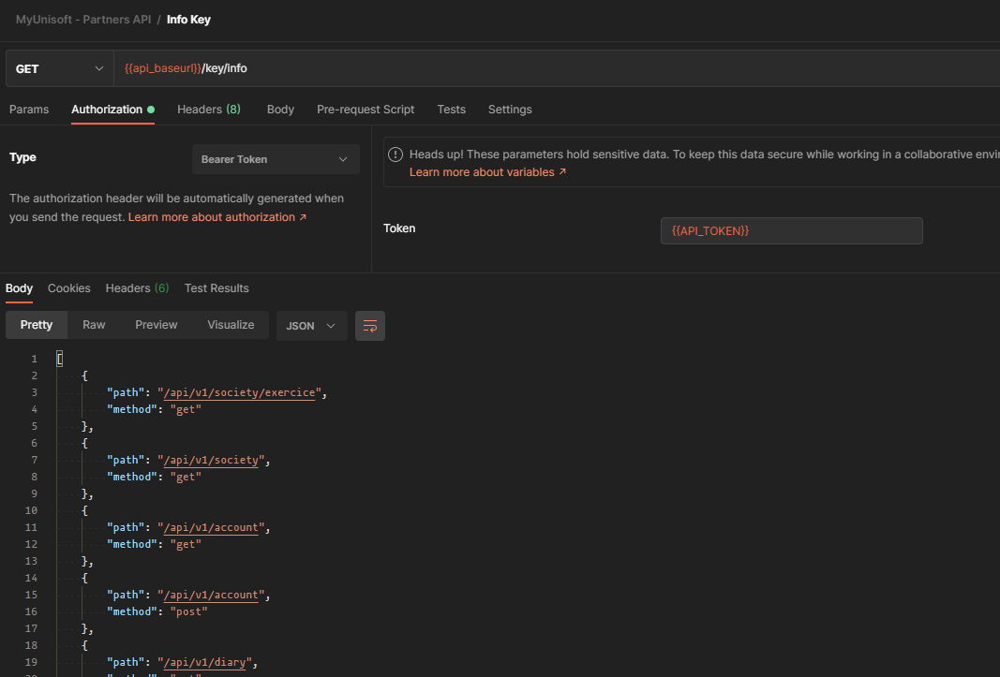

---
prev:
  text: 🐤 Introduction
  link: documentation.md
next: false
---
# Récupérer les routes accessibles

Il est possible de récupérer les informations liées à votre accès (token) en appelant la route  **GET** `https://api.myunisoft.fr/api/v1/key/info`

Les informations disponibles sont:
- routes accessibles.
- la version du token et s'il peut être mis à jour.
- le statut du token (activé ou non).
- le token décodé

## Liste des paramètres

| Nom | Type | Description | Obligatoire |
|---|---|---|---|
|mode| `extended` |Récupération des informations du token en plus des routes accessibles.|❌|



## Récupération des routes accessibles

> [!NOTE]
> Les routes accessibles sont définies en fonction de votre type d'accès (🔹Cabinet ou 🔸Société).

```bash
$ curl --location --request GET 'https://api.myunisoft.fr/api/v1/key/info' \
--header 'Authorization: Bearer {{ TOKEN }}' \
--header 'X-Third-Party-Secret: {{ X-Third-Party-Secret }}' \
```

<details>
  <summary markdown="span">Retour JSON de l'API</summary>

  Type [Routes](#types).


```json
[
  {
    "path": "/api/v1/society/exercice",
    "method": "get"
  },
  {
    "path": "/api/v1/society",
    "method": "get"
  },
  {
    "path": "/api/v1/account",
    "method": "get"
  },
  {
    "path": "/api/v1/diary",
    "method": "get"
  },
  {
    "path": "/api/v1/TRA/partial",
    "method": "post"
  },
  {
    "path": "/api/v1/test",
    "method": "get"
  }
]
```
</details>

## Récupération des informations du token et des routes accessibles

```bash
$ curl --location --request GET 'https://api.myunisoft.fr/api/v1/key/info?mode=extended' \
--header 'Authorization: Bearer {{ TOKEN }}' \
--header 'X-Third-Party-Secret: {{ X-Third-Party-Secret }}' \
```

<details>
  <summary markdown="span">Retour JSON de l'API</summary>

  Type [TokenDataWithRoutes](#types).

  ```json
  {
    "target": {
      "type": "api",
      "schemaId": 80,
      "thirdPartyId": 101,
      "societyId": 127
    },
    "version": {
      "current": 1,
      "latest": 1,
      "beta": false
    },
    "canBeActivated": true,
    "isActivated": true,
    "routes": [
      {
        "path": "/api/v1/society/exercie",
        "method": "get"
      },
      {
        "path": "/api/v1/society",
        "method": "get"
      },
      {
        "path": "/api/v1/account",
        "method": "get"
      },
      {
        "path": "/api/v1/diary",
        "method": "get"
      },
      {
        "path": "/api/v1/TRA/partial",
        "method": "post"
      },
      {
        "path": "/api/v1/test",
        "method": "get"
      }
    ]
  }
  ```
</details>

## Types
```ts
interface Route {
  path: `/api/v1/${string}`;
  method: 'get' | 'post' | 'put' | 'delete';
}

type Routes = Route[];

interface TokenDataWithRoutes {
  target: {
    type: "api" | "firm";
    schemaId: number;
    thirdPartyId: number;
    societyId: number;
  },
  version: {
    current: number;
    latest: number;
    beta: boolean;
  },
  canBeActivated: boolean;
  isActivated: boolean;
  routes: Routes;
}
```
