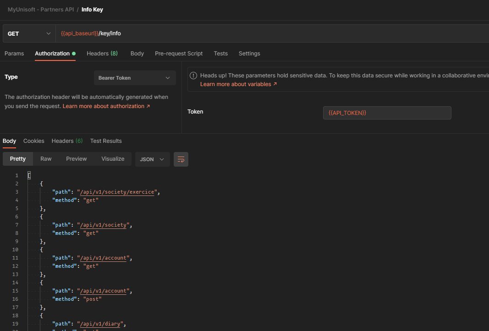

# Endpoints d'accès sociétés

Lors de l'utilisation des endpoints avec un accès de type société il n'est pas nécessaire de renseigner l'id de la société car par défaut l'API partenaires ne vous autorise l'accès qu'au dossier concerné par la clé.

Il n'est donc pas possible de récupérer des informations en lien avec le cabinet ou d'autres sociétés/dossiers.

Les routes sont documentés sur le [postman](https://docs.api.myunisoft.fr/#intro) en ligne.

## Routes accessibles avec l'API Token

Il est possible de récupérer la liste des routes (endpoints http) auxquelles vous avez accès **grâce à votre API Token** (Ce qui peut aussi vous permettre de vérifier la validité du token). La route GET **/api/v1/key/info** permet de récupérer la liste des routes ainsi que la méthode HTTP nécessaire (get, post, put ..).

Attention car la route nécessite que l'en-tête HTTP **Authorization soit l’API Token**.

## Restriction

Les routes `/pers_physique` et `/users_v2` ne sont utilisables qu'avec un accès de type cabinet.