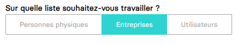
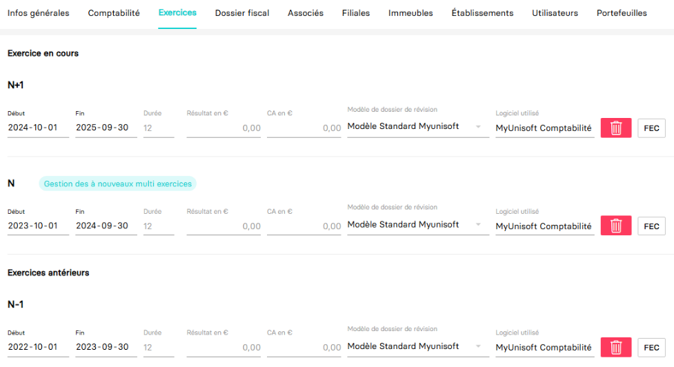

# Récupérer les exercices d'une société (dossier)
Ce guide a pour objectif de vous aider dans la récupération des exercices d'une société (dossier).

Dans MyUnisoft les exercices peuvent être gérés par le biais du CRM: `Ecosystème` > `CRM` > `Entreprise / Personne physique`.

Choisir "Entreprises" dans la liste:



Choisir l'onglet "Exercices":



## API

La route https://api.myunisoft.fr/api/v1/society/exercice permet de récupérer la même liste mais par le biais de l'API partenaires.

```bash
$ curl --location --request GET 'https://api.myunisoft.fr/api/v1/society/exercice' \
--header 'X-Third-Party-Secret: nompartenaire-L8vlKfjJ5y7zwFj2J49xo53V' \
--header 'Authorization: Bearer {{API_TOKEN}}'
```

> 👀 Penser à préciser l'en-tête **society-id** si vous utilisez un 🔹 Accès cabinet.

Si tout va bien vous devriez recevoir un JSON avec **une structure similaire à l'exemple ci-dessous**
```json
[
    {
        "exercice_id": 13647,
        "start_date": "20200101",
        "label": "N",
        "end_date": "20201231",
        "closed": false,
        "blocked": true,
        "duration": 12,
        "result": -42.33,
        "ca": -25,
        "closed_at": null,
        "closed_by": null
    }
]
```

## Définition TypeScript

Le endpoint **society/exercice** retourne un tableau de structure Exercice.

```ts
interface Exercice {
  exercice_id: number;
  start_date: string;
  label: string;
  end_date: string;
  closed: boolean;
  blocked: boolean;
  duration: number;
  result: number;
  ca: number;
  closed_at: null | string;
  closed_by: null | number;
}
```

Si l'exercice n'est pas un clos les valeurs `closed_at` et `closed_by` seront null.
