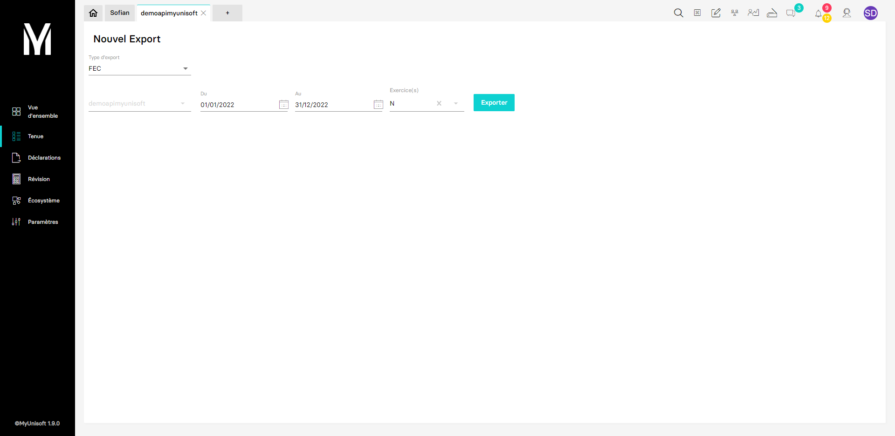

<span id="readme-top"></span>

# Exportation d'écritures comptables au format FEC

Ce guide a pour objectif de vous aider dans l'exportation d'écritures comptables au format FEC.

Dans MyUnisoft, l'exportation d'écritures comptables s'effectue dans le module: `Tenue` > `Flux` > `Exports`.



## Liste des paramètres

| Nom | Description | Obligatoire |
|---|---|---|
|export_type|Défini la période de sélection des écritures. `0` pour se baser sur un exercice et `1` pour un intervalle de temps donné|✔️|
|from|YYYY-MM-DD|Si `export_type` vaut `1`|
|to|YYYY-MM-DD|Si `export_type` vaut `1`|
|exercice_id||Si `export_type` vaut `0`|

## Export FEC

```bash
curl --location --request POST 'https://app.myunisoft.fr/api/v1/export/fec?export_type=0&exercice_id=159' \
--header 'X-Third-Party-Secret: X-Third-Party-Secret' \
--header 'Content-Type: application/json' \
--header 'society-id: 19' \
--header 'Authorization: Bearer TOKEN'
```

<details>
  <summary>Retour de l'API</summary>

  ```
  JournalCode|JournalLib|EcritureNum|EcritureDate|CompteNum|CompteLib|CompAuxNum|CompAuxLib|PieceRef|PieceDate|EcritureLib|Debit|Credit|EcritureLet|DateLet|ValidDate|Montantdevise|Idevise|RefInterne
40|JOURNAL AN|1|20220101|101200|CAPITAL APPELE NON VERSE|||0000|20220101|CAPITAL NON APPELE|0|150|||20220101|||E55435
40|JOURNAL AN|1|20220101|445712|TVA Collectée à 20%|||0210000002|20220101|Dupont|0|1000|||20220101|||D10935
40|JOURNAL AN|1|20220101|120000|COMPTE DE RESULTAT|||0210000002|20220101|A NOUVEAUX RESULTAT EX. BENEFICES|0|5000|||20220101|||D10935
40|JOURNAL AN|1|20220101|411DUPONT|Dupont|||0210000001|20220101|Dupont|0|5000|AAA||20220101|||D10933
40|JOURNAL AN|1|20220101|411DUPONT|Dupont|||0210000002|20220101|Dupont|6000|0|||20220101|||D10935
40|JOURNAL AN|1|20220101|411DUPONT|Dupont|||0210000001|20220101|Dupont|5000|0|AAA||20220101|||D10934
40|JOURNAL AN|1|20220101|101100|CAPITAL NON APPELE|||0000|20220101|CAPITAL NON APPELE|150|0|||20220101|||E55435
VE|JOURNAL VE|2|20220101|706120|Prestations de services|||0220100001|20220101|AB Conseil SAS|0|50000|||20220101|||D13621
VE|JOURNAL VE|2|20220101|411ABCONS|AB Conseil SAS|||0220100001|20220101|AB Conseil SAS|60000|0|||20220101|||D13621
VE|JOURNAL VE|2|20220101|445712|TVA Collectée à 20%|||0220100001|20220101|AB Conseil SAS|0|10000|||20220101|||D13621
VE|JOURNAL VE|3|20220114|706120|Prestations de services|||0220100002|20220114|Agence Dupond|0|2000|||20220114|||D13622
VE|JOURNAL VE|3|20220114|445712|TVA Collectée à 20%|||0220100002|20220114|Agence Dupond|0|400|||20220114|||D13622
VE|JOURNAL VE|3|20220114|411AGENCE|Agence Dupond|||0220100002|20220114|Agence Dupond|2400|0|||20220114|||D13622
VE|JOURNAL VE|4|20220115|706120|Prestations de services|||0220100003|20220115|AB Conseil SAS|0|50000|||20220115|||D13617
VE|JOURNAL VE|4|20220115|445712|TVA Collectée à 20%|||0220100003|20220115|AB Conseil SAS|0|10000|||20220115|||D13617
VE|JOURNAL VE|4|20220115|411ABCONS|AB Conseil SAS|||0220100003|20220115|AB Conseil SAS|60000|0|||20220115|||D13617
VE|JOURNAL VE|5|20220125|471000|Compte comptable d'attente|||00:0000097|20220125|LE COLORIS sprl|0|183,32|||20220125|||D19008
VE|JOURNAL VE|5|20220125|471000|Compte comptable d'attente|||00:0000097|20220125|LE COLORIS sprl|0|916,68|||20220125|||D19008
VE|JOURNAL VE|5|20220125|411901113|LE COLORIS sprl|||00:0000097|20220125|LE COLORIS sprl|1100|0|||20220125|||D19008
VE|JOURNAL VE|6|20220126|471000|Compte comptable d'attente|||00:0000098|20220126|Adelicia 2 SARL|0|150|||20220126|||D19010
VE|JOURNAL VE|6|20220126|411123456|Adelicia 2 SARL|||00:0000098|20220126|Adelicia 2 SARL|150|0|||20220126|||D19010
VE|JOURNAL VE|7|20220126|471000|Compte comptable d'attente|||0220100001|20220126|Adelicia 2 SARL|150|0|||20220126|||D18974
VE|JOURNAL VE|7|20220126|411123456|Adelicia 2 SARL|||0220100001|20220126|Adelicia 2 SARL|0|150|||20220126|||D18974
VE|JOURNAL VE|8|20220127|471000|Compte comptable d'attente|||00:0000099|20220127|demo|0|468|||20220127|||D19026
VE|JOURNAL VE|8|20220127|471000|Compte comptable d'attente|||00:0000099|20220127|demo|0|40|||20220127|||D19026
VE|JOURNAL VE|8|20220127|471000|Compte comptable d'attente|||00:0000099|20220127|demo|0|14,28|||20220127|||D19026
VE|JOURNAL VE|8|20220127|411C10800|demo|||00:0000099|20220127|demo|522,28|0|||20220127|||D19026
VE|JOURNAL VE|9|20220127|471000|Compte comptable d'attente|||00:0000100|20220127|demo|0|868|||20220127|||D19024
VE|JOURNAL VE|9|20220127|471000|Compte comptable d'attente|||00:0000100|20220127|demo|0|80|||20220127|||D19024
VE|JOURNAL VE|9|20220127|471000|Compte comptable d'attente|||00:0000100|20220127|demo|0|14,28|||20220127|||D19024
VE|JOURNAL VE|9|20220127|411C10800|demo|||00:0000100|20220127|demo|962,28|0|||20220127|||D19024
VE|JOURNAL VE|10|20220201|706120|Prestations de services|||0220200001|20220201|AB Conseil SAS|0|50000|||20220201|||D13616
VE|JOURNAL VE|10|20220201|445712|TVA Collectée à 20%|||0220200001|20220201|AB Conseil SAS|0|10000|||20220201|||D13616
VE|JOURNAL VE|10|20220201|411ABCONS|AB Conseil SAS|||0220200001|20220201|AB Conseil SAS|60000|0|||20220201|||D13616
VE|JOURNAL VE|11|20220201|471000|Compte comptable d'attente|||00:0000101|20220201|Cooper David|0|2,95|||20220201|||D18948
VE|JOURNAL VE|11|20220201|471000|Compte comptable d'attente|||00:0000101|20220201|Cooper David|0|43,84|||20220201|||D18948
VE|JOURNAL VE|11|20220201|471000|Compte comptable d'attente|||00:0000101|20220201|Cooper David|0|2,91|||20220201|||D18948
VE|JOURNAL VE|11|20220201|411901114|Cooper David|||00:0000101|20220201|Cooper David|49,7|0|||20220201|||D18948
VE|JOURNAL VE|12|20220201|471000|Compte comptable d'attente|||00:0000102|20220201|MIGNE Romain|0|46,28|||20220201|||D18984
VE|JOURNAL VE|12|20220201|471000|Compte comptable d'attente|||00:0000102|20220201|MIGNE Romain|0|3,32|||20220201|||D18984
VE|JOURNAL VE|12|20220201|471000|Compte comptable d'attente|||00:0000102|20220201|MIGNE Romain|0|2,62|||20220201|||D18984
VE|JOURNAL VE|12|20220201|411901115|MIGNE Romain|||00:0000102|20220201|MIGNE Romain|52,22|0|||20220201|||D18984
VE|JOURNAL VE|13|20220201|471000|Compte comptable d'attente|||00:0000103|20220201|BRONIARCZYK Aurelie|0|47,95|||20220201|||D19001
VE|JOURNAL VE|13|20220201|471000|Compte comptable d'attente|||00:0000103|20220201|BRONIARCZYK Aurelie|0|2,82|||20220201|||D19001
VE|JOURNAL VE|13|20220201|471000|Compte comptable d'attente|||00:0000103|20220201|BRONIARCZYK Aurelie|0|3,95|||20220201|||D19001
VE|JOURNAL VE|13|20220201|411901116|BRONIARCZYK Aurelie|||00:0000103|20220201|BRONIARCZYK Aurelie|54,72|0|||20220201|||D19001
VE|JOURNAL VE|14|20220201|471000|Compte comptable d'attente|||00:0000104|20220201|Etienne Patricia|0|41,28|||20220201|||D18990
VE|JOURNAL VE|14|20220201|471000|Compte comptable d'attente|||00:0000104|20220201|Etienne Patricia|0|2,82|||20220201|||D18990
VE|JOURNAL VE|14|20220201|471000|Compte comptable d'attente|||00:0000104|20220201|Etienne Patricia|0|2,62|||20220201|||D18990
VE|JOURNAL VE|14|20220201|411901117|Etienne Patricia|||00:0000104|20220201|Etienne Patricia|46,72|0|||20220201|||D18990
VE|JOURNAL VE|15|20220201|471000|Compte comptable d'attente|||00:0000105|20220201|MERCIER DIDIER|0|29,83|||20220201|||D18962
VE|JOURNAL VE|15|20220201|471000|Compte comptable d'attente|||00:0000105|20220201|MERCIER DIDIER|0|1,67|||20220201|||D18962
VE|JOURNAL VE|15|20220201|471000|Compte comptable d'attente|||00:0000105|20220201|MERCIER DIDIER|0|2,62|||20220201|||D18962
VE|JOURNAL VE|15|20220201|411901118|MERCIER DIDIER|||00:0000105|20220201|MERCIER DIDIER|34,12|0|||20220201|||D18962
VE|JOURNAL VE|16|20220201|471000|Compte comptable d'attente|||00:0000106|20220201|Couture Logan|0|110,31|||20220201|||D18999
VE|JOURNAL VE|16|20220201|471000|Compte comptable d'attente|||00:0000106|20220201|Couture Logan|0|8,75|||20220201|||D18999
VE|JOURNAL VE|16|20220201|471000|Compte comptable d'attente|||00:0000106|20220201|Couture Logan|0|3,76|||20220201|||D18999
VE|JOURNAL VE|16|20220201|471000|Compte comptable d'attente|||00:0000106|20220201|Couture Logan|4,09|0|||20220201|||D18999
VE|JOURNAL VE|16|20220201|478000|Compte comptable d'écart|||00:0000106|20220201|Couture Logan|0|0,06|||20220201|||D18999
VE|JOURNAL VE|16|20220201|411901119|Couture Logan|||00:0000106|20220201|Couture Logan|118,79|0|||20220201|||D18999
VE|JOURNAL VE|17|20220201|471000|Compte comptable d'attente|||00:0000107|20220201|Gallou Nicolas|0|48,7|||20220201|||D18960
VE|JOURNAL VE|17|20220201|471000|Compte comptable d'attente|||00:0000107|20220201|Gallou Nicolas|0|4,1|||20220201|||D18960
VE|JOURNAL VE|17|20220201|471000|Compte comptable d'attente|||00:0000107|20220201|Gallou Nicolas|0|2,82|||20220201|||D18960
VE|JOURNAL VE|17|20220201|411901120|Gallou Nicolas|||00:0000107|20220201|Gallou Nicolas|55,62|0|||20220201|||D18960
VE|JOURNAL VE|18|20220201|471000|Compte comptable d'attente|||00:0000108|20220201|bourne bernard|0|67,93|||20220201|||D18998
VE|JOURNAL VE|18|20220201|471000|Compte comptable d'attente|||00:0000108|20220201|bourne bernard|0|5,32|||20220201|||D18998
VE|JOURNAL VE|18|20220201|471000|Compte comptable d'attente|||00:0000108|20220201|bourne bernard|0|2,95|||20220201|||D18998
VE|JOURNAL VE|18|20220201|411901121|bourne bernard|||00:0000108|20220201|bourne bernard|76,2|0|||20220201|||D18998
VE|JOURNAL VE|19|20220201|471000|Compte comptable d'attente|||00:0000109|20220201|HENRY Patricia|0|20,85|||20220201|||D18969
VE|JOURNAL VE|19|20220201|471000|Compte comptable d'attente|||00:0000109|20220201|HENRY Patricia|0|0,85|||20220201|||D18969
VE|JOURNAL VE|19|20220201|471000|Compte comptable d'attente|||00:0000109|20220201|HENRY Patricia|0|2,46|||20220201|||D18969
VE|JOURNAL VE|19|20220201|411901122|HENRY Patricia|||00:0000109|20220201|HENRY Patricia|24,16|0|||20220201|||D18969
VE|JOURNAL VE|20|20220201|471000|Compte comptable d'attente|||00:0000110|20220201|Yves Gastel|0|83,13|||20220201|||D19009
VE|JOURNAL VE|20|20220201|471000|Compte comptable d'attente|||00:0000110|20220201|Yves Gastel|0|6,34|||20220201|||D19009
VE|JOURNAL VE|20|20220201|471000|Compte comptable d'attente|||00:0000110|20220201|Yves Gastel|0|3,95|||20220201|||D19009
VE|JOURNAL VE|20|20220201|411901123|Yves Gastel|||00:0000110|20220201|Yves Gastel|93,42|0|||20220201|||D19009
VE|JOURNAL VE|21|20220201|471000|Compte comptable d'attente|||00:0000111|20220201|MARCHAL Marie-Laetitia|0|21,12|||20220201|||D19007
VE|JOURNAL VE|21|20220201|471000|Compte comptable d'attente|||00:0000111|20220201|MARCHAL Marie-Laetitia|0|0,85|||20220201|||D19007
VE|JOURNAL VE|21|20220201|471000|Compte comptable d'attente|||00:0000111|20220201|MARCHAL Marie-Laetitia|0|2,36|||20220201|||D19007
VE|JOURNAL VE|21|20220201|471000|Compte comptable d'attente|||00:0000111|20220201|MARCHAL Marie-Laetitia|0,88|0|||20220201|||D19007
VE|JOURNAL VE|21|20220201|478000|Compte comptable d'écart|||00:0000111|20220201|MARCHAL Marie-Laetitia|0|0,04|||20220201|||D19007
VE|JOURNAL VE|21|20220201|411901124|MARCHAL Marie-Laetitia|||00:0000111|20220201|MARCHAL Marie-Laetitia|23,49|0|||20220201|||D19007
VE|JOURNAL VE|22|20220201|471000|Compte comptable d'attente|||00:0000112|20220201|HEUSSLER CECILE|0|32,15|||20220201|||D19005
VE|JOURNAL VE|22|20220201|471000|Compte comptable d'attente|||00:0000112|20220201|HEUSSLER CECILE|0|3,79|||20220201|||D19005
VE|JOURNAL VE|22|20220201|471000|Compte comptable d'attente|||00:0000112|20220201|HEUSSLER CECILE|0|1,32|||20220201|||D19005
VE|JOURNAL VE|22|20220201|411901125|HEUSSLER CECILE|||00:0000112|20220201|HEUSSLER CECILE|37,26|0|||20220201|||D19005
VE|JOURNAL VE|23|20220201|471000|Compte comptable d'attente|||00:0000113|20220201|Helle Thierry|0|25,13|||20220201|||D18964
VE|JOURNAL VE|23|20220201|471000|Compte comptable d'attente|||00:0000113|20220201|Helle Thierry|0|1,27|||20220201|||D18964
VE|JOURNAL VE|23|20220201|471000|Compte comptable d'attente|||00:0000113|20220201|Helle Thierry|0|2,46|||20220201|||D18964
VE|JOURNAL VE|23|20220201|411901126|Helle Thierry|||00:0000113|20220201|Helle Thierry|28,86|0|||20220201|||D18964
VE|JOURNAL VE|24|20220201|471000|Compte comptable d'attente|||00:0000114|20220201|Mazoyer marchand Christine|0|53,46|||20220201|||D18975
VE|JOURNAL VE|24|20220201|471000|Compte comptable d'attente|||00:0000114|20220201|Mazoyer marchand Christine|0|3,22|||20220201|||D18975
VE|JOURNAL VE|24|20220201|471000|Compte comptable d'attente|||00:0000114|20220201|Mazoyer marchand Christine|0|4,24|||20220201|||D18975
VE|JOURNAL VE|24|20220201|411901127|Mazoyer marchand Christine|||00:0000114|20220201|Mazoyer marchand Christine|60,92|0|||20220201|||D18975
VE|JOURNAL VE|25|20220201|471000|Compte comptable d'attente|||00:0000115|20220201|Girardin Claire|0|28,11|||20220201|||D18991
VE|JOURNAL VE|25|20220201|471000|Compte comptable d'attente|||00:0000115|20220201|Girardin Claire|0|1,59|||20220201|||D18991
VE|JOURNAL VE|25|20220201|471000|Compte comptable d'attente|||00:0000115|20220201|Girardin Claire|0|2,46|||20220201|||D18991
VE|JOURNAL VE|25|20220201|411901128|Girardin Claire|||00:0000115|20220201|Girardin Claire|32,16|0|||20220201|||D18991
VE|JOURNAL VE|26|20220201|471000|Compte comptable d'attente|||00:0000116|20220201|lange franciska|0|36,88|||20220201|||D19019
VE|JOURNAL VE|26|20220201|471000|Compte comptable d'attente|||00:0000116|20220201|lange franciska|0|1,65|||20220201|||D19019
VE|JOURNAL VE|26|20220201|471000|Compte comptable d'attente|||00:0000116|20220201|lange franciska|0|4,09|||20220201|||D19019
VE|JOURNAL VE|26|20220201|411901129|lange franciska|||00:0000116|20220201|lange franciska|42,62|0|||20220201|||D19019
VE|JOURNAL VE|27|20220201|471000|Compte comptable d'attente|||00:0000117|20220201|PERROT JACQUELINE|0|21,39|||20220201|||D18985
VE|JOURNAL VE|27|20220201|471000|Compte comptable d'attente|||00:0000117|20220201|PERROT JACQUELINE|0|0,91|||20220201|||D18985
VE|JOURNAL VE|27|20220201|471000|Compte comptable d'attente|||00:0000117|20220201|PERROT JACQUELINE|0|2,46|||20220201|||D18985
VE|JOURNAL VE|27|20220201|411901130|PERROT JACQUELINE|||00:0000117|20220201|PERROT JACQUELINE|24,76|0|||20220201|||D18985
VE|JOURNAL VE|28|20220201|471000|Compte comptable d'attente|||00:0000118|20220201|courréjou régis|0|49,31|||20220201|||D19017
VE|JOURNAL VE|28|20220201|471000|Compte comptable d'attente|||00:0000118|20220201|courréjou régis|0|3,21|||20220201|||D19017
VE|JOURNAL VE|28|20220201|471000|Compte comptable d'attente|||00:0000118|20220201|courréjou régis|0|2,75|||20220201|||D19017
VE|JOURNAL VE|28|20220201|471000|Compte comptable d'attente|||00:0000118|20220201|courréjou régis|3,46|0|||20220201|||D19017
VE|JOURNAL VE|28|20220201|478000|Compte comptable d'écart|||00:0000118|20220201|courréjou régis|0|0,09|||20220201|||D19017
VE|JOURNAL VE|28|20220201|411901131|courréjou régis|||00:0000118|20220201|courréjou régis|51,9|0|||20220201|||D19017
VE|JOURNAL VE|29|20220201|471000|Compte comptable d'attente|||00:0000119|20220201|HERVE Guillaume|0|157,16|||20220201|||D19013
VE|JOURNAL VE|29|20220201|471000|Compte comptable d'attente|||00:0000119|20220201|HERVE Guillaume|0|9,25|||20220201|||D19013
VE|JOURNAL VE|29|20220201|471000|Compte comptable d'attente|||00:0000119|20220201|HERVE Guillaume|0|12,91|||20220201|||D19013
VE|JOURNAL VE|29|20220201|411901132|HERVE Guillaume|||00:0000119|20220201|HERVE Guillaume|179,32|0|||20220201|||D19013
VE|JOURNAL VE|30|20220201|471000|Compte comptable d'attente|||00:0000120|20220201|Levillain Alexandre|0|47,65|||20220201|||D18979
VE|JOURNAL VE|30|20220201|471000|Compte comptable d'attente|||00:0000120|20220201|Levillain Alexandre|0|2,82|||20220201|||D18979
VE|JOURNAL VE|30|20220201|471000|Compte comptable d'attente|||00:0000120|20220201|Levillain Alexandre|0|3,89|||20220201|||D18979
VE|JOURNAL VE|30|20220201|411901133|Levillain Alexandre|||00:0000120|20220201|Levillain Alexandre|54,36|0|||20220201|||D18979
VE|JOURNAL VE|31|20220201|471000|Compte comptable d'attente|||00:0000121|20220201|TEITIENNE Yannick|0|164,03|||20220201|||D18978
VE|JOURNAL VE|31|20220201|471000|Compte comptable d'attente|||00:0000121|20220201|TEITIENNE Yannick|0|11,81|||20220201|||D18978
VE|JOURNAL VE|31|20220201|471000|Compte comptable d'attente|||00:0000121|20220201|TEITIENNE Yannick|0|9,18|||20220201|||D18978
VE|JOURNAL VE|31|20220201|411901134|TEITIENNE Yannick|||00:0000121|20220201|TEITIENNE Yannick|185,02|0|||20220201|||D18978
VE|JOURNAL VE|32|20220201|471000|Compte comptable d'attente|||00:0000122|20220201|Cooper David|0|43,84|||20220201|||D18967
VE|JOURNAL VE|32|20220201|471000|Compte comptable d'attente|||00:0000122|20220201|Cooper David|0|2,91|||20220201|||D18967
VE|JOURNAL VE|32|20220201|471000|Compte comptable d'attente|||00:0000122|20220201|Cooper David|0|2,95|||20220201|||D18967
VE|JOURNAL VE|32|20220201|411901114|Cooper David|||00:0000122|20220201|Cooper David|49,7|0|||20220201|||D18967
VE|JOURNAL VE|33|20220201|471000|Compte comptable d'attente|||00:0000123|20220201|MIGNE Romain|0|46,28|||20220201|||D18983
VE|JOURNAL VE|33|20220201|471000|Compte comptable d'attente|||00:0000123|20220201|MIGNE Romain|0|3,32|||20220201|||D18983
VE|JOURNAL VE|33|20220201|471000|Compte comptable d'attente|||00:0000123|20220201|MIGNE Romain|0|2,62|||20220201|||D18983
VE|JOURNAL VE|33|20220201|411901115|MIGNE Romain|||00:0000123|20220201|MIGNE Romain|52,22|0|||20220201|||D18983
VE|JOURNAL VE|34|20220201|471000|Compte comptable d'attente|||00:0000124|20220201|BRONIARCZYK Aurelie|0|47,95|||20220201|||D18953
VE|JOURNAL VE|34|20220201|471000|Compte comptable d'attente|||00:0000124|20220201|BRONIARCZYK Aurelie|0|2,82|||20220201|||D18953
VE|JOURNAL VE|34|20220201|471000|Compte comptable d'attente|||00:0000124|20220201|BRONIARCZYK Aurelie|0|3,95|||20220201|||D18953
VE|JOURNAL VE|34|20220201|411901116|BRONIARCZYK Aurelie|||00:0000124|20220201|BRONIARCZYK Aurelie|54,72|0|||20220201|||D18953
VE|JOURNAL VE|35|20220201|471000|Compte comptable d'attente|||00:0000125|20220201|Etienne Patricia|0|41,28|||20220201|||D19021
VE|JOURNAL VE|35|20220201|471000|Compte comptable d'attente|||00:0000125|20220201|Etienne Patricia|0|2,82|||20220201|||D19021
VE|JOURNAL VE|35|20220201|471000|Compte comptable d'attente|||00:0000125|20220201|Etienne Patricia|0|2,62|||20220201|||D19021
VE|JOURNAL VE|35|20220201|411901117|Etienne Patricia|||00:0000125|20220201|Etienne Patricia|46,72|0|||20220201|||D19021
VE|JOURNAL VE|36|20220201|471000|Compte comptable d'attente|||00:0000126|20220201|MERCIER DIDIER|0|29,83|||20220201|||D18954
VE|JOURNAL VE|36|20220201|471000|Compte comptable d'attente|||00:0000126|20220201|MERCIER DIDIER|0|1,67|||20220201|||D18954
VE|JOURNAL VE|36|20220201|471000|Compte comptable d'attente|||00:0000126|20220201|MERCIER DIDIER|0|2,62|||20220201|||D18954
VE|JOURNAL VE|36|20220201|411901118|MERCIER DIDIER|||00:0000126|20220201|MERCIER DIDIER|34,12|0|||20220201|||D18954
VE|JOURNAL VE|37|20220201|478000|Compte comptable d'écart|||00:0000127|20220201|Couture Logan|0|0,06|||20220201|||D19004
VE|JOURNAL VE|37|20220201|471000|Compte comptable d'attente|||00:0000127|20220201|Couture Logan|0|110,31|||20220201|||D19004
VE|JOURNAL VE|37|20220201|471000|Compte comptable d'attente|||00:0000127|20220201|Couture Logan|0|8,75|||20220201|||D19004
VE|JOURNAL VE|37|20220201|471000|Compte comptable d'attente|||00:0000127|20220201|Couture Logan|0|3,76|||20220201|||D19004
VE|JOURNAL VE|37|20220201|471000|Compte comptable d'attente|||00:0000127|20220201|Couture Logan|4,09|0|||20220201|||D19004
VE|JOURNAL VE|37|20220201|411901119|Couture Logan|||00:0000127|20220201|Couture Logan|118,79|0|||20220201|||D19004
VE|JOURNAL VE|38|20220201|471000|Compte comptable d'attente|||00:0000128|20220201|Gallou Nicolas|0|48,7|||20220201|||D18952
VE|JOURNAL VE|38|20220201|471000|Compte comptable d'attente|||00:0000128|20220201|Gallou Nicolas|0|4,1|||20220201|||D18952
VE|JOURNAL VE|38|20220201|471000|Compte comptable d'attente|||00:0000128|20220201|Gallou Nicolas|0|2,82|||20220201|||D18952
VE|JOURNAL VE|38|20220201|411901120|Gallou Nicolas|||00:0000128|20220201|Gallou Nicolas|55,62|0|||20220201|||D18952
VE|JOURNAL VE|39|20220201|471000|Compte comptable d'attente|||00:0000129|20220201|bourne bernard|0|67,93|||20220201|||D18950
VE|JOURNAL VE|39|20220201|471000|Compte comptable d'attente|||00:0000129|20220201|bourne bernard|0|5,32|||20220201|||D18950
VE|JOURNAL VE|39|20220201|471000|Compte comptable d'attente|||00:0000129|20220201|bourne bernard|0|2,95|||20220201|||D18950
VE|JOURNAL VE|39|20220201|411901121|bourne bernard|||00:0000129|20220201|bourne bernard|76,2|0|||20220201|||D18950
VE|JOURNAL VE|40|20220201|471000|Compte comptable d'attente|||00:0000130|20220201|HENRY Patricia|0|20,85|||20220201|||D19029
VE|JOURNAL VE|40|20220201|471000|Compte comptable d'attente|||00:0000130|20220201|HENRY Patricia|0|0,85|||20220201|||D19029
VE|JOURNAL VE|40|20220201|471000|Compte comptable d'attente|||00:0000130|20220201|HENRY Patricia|0|2,46|||20220201|||D19029
VE|JOURNAL VE|40|20220201|411901122|HENRY Patricia|||00:0000130|20220201|HENRY Patricia|24,16|0|||20220201|||D19029
VE|JOURNAL VE|41|20220201|471000|Compte comptable d'attente|||00:0000131|20220201|Yves Gastel|0|83,13|||20220201|||D18957
VE|JOURNAL VE|41|20220201|471000|Compte comptable d'attente|||00:0000131|20220201|Yves Gastel|0|6,34|||20220201|||D18957
VE|JOURNAL VE|41|20220201|471000|Compte comptable d'attente|||00:0000131|20220201|Yves Gastel|0|3,95|||20220201|||D18957
VE|JOURNAL VE|41|20220201|411901123|Yves Gastel|||00:0000131|20220201|Yves Gastel|93,42|0|||20220201|||D18957
VE|JOURNAL VE|42|20220201|471000|Compte comptable d'attente|||00:0000132|20220201|MARCHAL Marie-Laetitia|0|21,12|||20220201|||D18986
VE|JOURNAL VE|42|20220201|471000|Compte comptable d'attente|||00:0000132|20220201|MARCHAL Marie-Laetitia|0|0,85|||20220201|||D18986
VE|JOURNAL VE|42|20220201|471000|Compte comptable d'attente|||00:0000132|20220201|MARCHAL Marie-Laetitia|0|2,36|||20220201|||D18986
VE|JOURNAL VE|42|20220201|471000|Compte comptable d'attente|||00:0000132|20220201|MARCHAL Marie-Laetitia|0,88|0|||20220201|||D18986
VE|JOURNAL VE|42|20220201|478000|Compte comptable d'écart|||00:0000132|20220201|MARCHAL Marie-Laetitia|0|0,04|||20220201|||D18986
VE|JOURNAL VE|42|20220201|411901124|MARCHAL Marie-Laetitia|||00:0000132|20220201|MARCHAL Marie-Laetitia|23,49|0|||20220201|||D18986
VE|JOURNAL VE|43|20220201|471000|Compte comptable d'attente|||00:0000133|20220201|HEUSSLER CECILE|0|32,15|||20220201|||D18955
VE|JOURNAL VE|43|20220201|471000|Compte comptable d'attente|||00:0000133|20220201|HEUSSLER CECILE|0|3,79|||20220201|||D18955
VE|JOURNAL VE|43|20220201|471000|Compte comptable d'attente|||00:0000133|20220201|HEUSSLER CECILE|0|1,32|||20220201|||D18955
VE|JOURNAL VE|43|20220201|411901125|HEUSSLER CECILE|||00:0000133|20220201|HEUSSLER CECILE|37,26|0|||20220201|||D18955
VE|JOURNAL VE|44|20220201|471000|Compte comptable d'attente|||00:0000134|20220201|Helle Thierry|0|25,13|||20220201|||D18951
VE|JOURNAL VE|44|20220201|471000|Compte comptable d'attente|||00:0000134|20220201|Helle Thierry|0|1,27|||20220201|||D18951
VE|JOURNAL VE|44|20220201|471000|Compte comptable d'attente|||00:0000134|20220201|Helle Thierry|0|2,46|||20220201|||D18951
VE|JOURNAL VE|44|20220201|411901126|Helle Thierry|||00:0000134|20220201|Helle Thierry|28,86|0|||20220201|||D18951
VE|JOURNAL VE|45|20220201|471000|Compte comptable d'attente|||00:0000135|20220201|Mazoyer marchand Christine|0|53,46|||20220201|||D19022
VE|JOURNAL VE|45|20220201|471000|Compte comptable d'attente|||00:0000135|20220201|Mazoyer marchand Christine|0|3,22|||20220201|||D19022
VE|JOURNAL VE|45|20220201|471000|Compte comptable d'attente|||00:0000135|20220201|Mazoyer marchand Christine|0|4,24|||20220201|||D19022
VE|JOURNAL VE|45|20220201|411901127|Mazoyer marchand Christine|||00:0000135|20220201|Mazoyer marchand Christine|60,92|0|||20220201|||D19022
VE|JOURNAL VE|46|20220201|471000|Compte comptable d'attente|||00:0000136|20220201|Girardin Claire|0|28,11|||20220201|||D18996
VE|JOURNAL VE|46|20220201|471000|Compte comptable d'attente|||00:0000136|20220201|Girardin Claire|0|1,59|||20220201|||D18996
VE|JOURNAL VE|46|20220201|471000|Compte comptable d'attente|||00:0000136|20220201|Girardin Claire|0|2,46|||20220201|||D18996
VE|JOURNAL VE|46|20220201|411901128|Girardin Claire|||00:0000136|20220201|Girardin Claire|32,16|0|||20220201|||D18996
VE|JOURNAL VE|47|20220201|471000|Compte comptable d'attente|||00:0000137|20220201|lange franciska|0|36,88|||20220201|||D19000
VE|JOURNAL VE|47|20220201|471000|Compte comptable d'attente|||00:0000137|20220201|lange franciska|0|1,65|||20220201|||D19000
VE|JOURNAL VE|47|20220201|471000|Compte comptable d'attente|||00:0000137|20220201|lange franciska|0|4,09|||20220201|||D19000
VE|JOURNAL VE|47|20220201|411901129|lange franciska|||00:0000137|20220201|lange franciska|42,62|0|||20220201|||D19000
VE|JOURNAL VE|48|20220201|471000|Compte comptable d'attente|||00:0000138|20220201|PERROT JACQUELINE|0|21,39|||20220201|||D19003
VE|JOURNAL VE|48|20220201|471000|Compte comptable d'attente|||00:0000138|20220201|PERROT JACQUELINE|0|0,91|||20220201|||D19003
VE|JOURNAL VE|48|20220201|471000|Compte comptable d'attente|||00:0000138|20220201|PERROT JACQUELINE|0|2,46|||20220201|||D19003
VE|JOURNAL VE|48|20220201|411901130|PERROT JACQUELINE|||00:0000138|20220201|PERROT JACQUELINE|24,76|0|||20220201|||D19003
VE|JOURNAL VE|49|20220201|471000|Compte comptable d'attente|||00:0000139|20220201|courréjou régis|0|49,31|||20220201|||D19030
VE|JOURNAL VE|49|20220201|471000|Compte comptable d'attente|||00:0000139|20220201|courréjou régis|0|3,21|||20220201|||D19030
VE|JOURNAL VE|49|20220201|471000|Compte comptable d'attente|||00:0000139|20220201|courréjou régis|0|2,75|||20220201|||D19030
VE|JOURNAL VE|49|20220201|471000|Compte comptable d'attente|||00:0000139|20220201|courréjou régis|3,46|0|||20220201|||D19030
VE|JOURNAL VE|49|20220201|478000|Compte comptable d'écart|||00:0000139|20220201|courréjou régis|0|0,09|||20220201|||D19030
VE|JOURNAL VE|49|20220201|411901131|courréjou régis|||00:0000139|20220201|courréjou régis|51,9|0|||20220201|||D19030
VE|JOURNAL VE|50|20220201|471000|Compte comptable d'attente|||00:0000140|20220201|HERVE Guillaume|0|157,16|||20220201|||D19011
VE|JOURNAL VE|50|20220201|471000|Compte comptable d'attente|||00:0000140|20220201|HERVE Guillaume|0|9,25|||20220201|||D19011
VE|JOURNAL VE|50|20220201|471000|Compte comptable d'attente|||00:0000140|20220201|HERVE Guillaume|0|12,91|||20220201|||D19011
VE|JOURNAL VE|50|20220201|411901132|HERVE Guillaume|||00:0000140|20220201|HERVE Guillaume|179,32|0|||20220201|||D19011
VE|JOURNAL VE|51|20220201|471000|Compte comptable d'attente|||00:0000141|20220201|Levillain Alexandre|0|47,65|||20220201|||D18997
VE|JOURNAL VE|51|20220201|471000|Compte comptable d'attente|||00:0000141|20220201|Levillain Alexandre|0|2,82|||20220201|||D18997
VE|JOURNAL VE|51|20220201|471000|Compte comptable d'attente|||00:0000141|20220201|Levillain Alexandre|0|3,89|||20220201|||D18997
VE|JOURNAL VE|51|20220201|411901133|Levillain Alexandre|||00:0000141|20220201|Levillain Alexandre|54,36|0|||20220201|||D18997
VE|JOURNAL VE|52|20220201|471000|Compte comptable d'attente|||00:0000142|20220201|TEITIENNE Yannick|0|164,03|||20220201|||D18995
VE|JOURNAL VE|52|20220201|471000|Compte comptable d'attente|||00:0000142|20220201|TEITIENNE Yannick|0|11,81|||20220201|||D18995
VE|JOURNAL VE|52|20220201|471000|Compte comptable d'attente|||00:0000142|20220201|TEITIENNE Yannick|0|9,18|||20220201|||D18995
VE|JOURNAL VE|52|20220201|411901134|TEITIENNE Yannick|||00:0000142|20220201|TEITIENNE Yannick|185,02|0|||20220201|||D18995
VE|JOURNAL VE|53|20220201|471000|Compte comptable d'attente|||00:0000143|20220201|Cooper David|0|43,84|||20220201|||D18946
VE|JOURNAL VE|53|20220201|471000|Compte comptable d'attente|||00:0000143|20220201|Cooper David|0|2,91|||20220201|||D18946
VE|JOURNAL VE|53|20220201|471000|Compte comptable d'attente|||00:0000143|20220201|Cooper David|0|2,95|||20220201|||D18946
VE|JOURNAL VE|53|20220201|411901114|Cooper David|||00:0000143|20220201|Cooper David|49,7|0|||20220201|||D18946
VE|JOURNAL VE|54|20220201|471000|Compte comptable d'attente|||00:0000144|20220201|MIGNE Romain|0|46,28|||20220201|||D19018
VE|JOURNAL VE|54|20220201|471000|Compte comptable d'attente|||00:0000144|20220201|MIGNE Romain|0|3,32|||20220201|||D19018
VE|JOURNAL VE|54|20220201|471000|Compte comptable d'attente|||00:0000144|20220201|MIGNE Romain|0|2,62|||20220201|||D19018
VE|JOURNAL VE|54|20220201|411901115|MIGNE Romain|||00:0000144|20220201|MIGNE Romain|52,22|0|||20220201|||D19018
VE|JOURNAL VE|55|20220201|471000|Compte comptable d'attente|||00:0000145|20220201|BRONIARCZYK Aurelie|0|47,95|||20220201|||D18993
VE|JOURNAL VE|55|20220201|471000|Compte comptable d'attente|||00:0000145|20220201|BRONIARCZYK Aurelie|0|2,82|||20220201|||D18993
VE|JOURNAL VE|55|20220201|471000|Compte comptable d'attente|||00:0000145|20220201|BRONIARCZYK Aurelie|0|3,95|||20220201|||D18993
VE|JOURNAL VE|55|20220201|411901116|BRONIARCZYK Aurelie|||00:0000145|20220201|BRONIARCZYK Aurelie|54,72|0|||20220201|||D18993
VE|JOURNAL VE|56|20220201|471000|Compte comptable d'attente|||00:0000146|20220201|Etienne Patricia|0|41,28|||20220201|||D19012
VE|JOURNAL VE|56|20220201|471000|Compte comptable d'attente|||00:0000146|20220201|Etienne Patricia|0|2,82|||20220201|||D19012
VE|JOURNAL VE|56|20220201|471000|Compte comptable d'attente|||00:0000146|20220201|Etienne Patricia|0|2,62|||20220201|||D19012
VE|JOURNAL VE|56|20220201|411901117|Etienne Patricia|||00:0000146|20220201|Etienne Patricia|46,72|0|||20220201|||D19012
VE|JOURNAL VE|57|20220201|471000|Compte comptable d'attente|||00:0000147|20220201|MERCIER DIDIER|0|29,83|||20220201|||D19014
VE|JOURNAL VE|57|20220201|471000|Compte comptable d'attente|||00:0000147|20220201|MERCIER DIDIER|0|1,67|||20220201|||D19014
VE|JOURNAL VE|57|20220201|471000|Compte comptable d'attente|||00:0000147|20220201|MERCIER DIDIER|0|2,62|||20220201|||D19014
VE|JOURNAL VE|57|20220201|411901118|MERCIER DIDIER|||00:0000147|20220201|MERCIER DIDIER|34,12|0|||20220201|||D19014
VE|JOURNAL VE|58|20220201|471000|Compte comptable d'attente|||00:0000148|20220201|Couture Logan|0|110,31|||20220201|||D18982
VE|JOURNAL VE|58|20220201|471000|Compte comptable d'attente|||00:0000148|20220201|Couture Logan|0|8,75|||20220201|||D18982
VE|JOURNAL VE|58|20220201|471000|Compte comptable d'attente|||00:0000148|20220201|Couture Logan|0|3,76|||20220201|||D18982
VE|JOURNAL VE|58|20220201|471000|Compte comptable d'attente|||00:0000148|20220201|Couture Logan|4,09|0|||20220201|||D18982
VE|JOURNAL VE|58|20220201|478000|Compte comptable d'écart|||00:0000148|20220201|Couture Logan|0|0,06|||20220201|||D18982
VE|JOURNAL VE|58|20220201|411901119|Couture Logan|||00:0000148|20220201|Couture Logan|118,79|0|||20220201|||D18982
VE|JOURNAL VE|59|20220201|471000|Compte comptable d'attente|||00:0000149|20220201|Gallou Nicolas|0|48,7|||20220201|||D19025
VE|JOURNAL VE|59|20220201|471000|Compte comptable d'attente|||00:0000149|20220201|Gallou Nicolas|0|4,1|||20220201|||D19025
VE|JOURNAL VE|59|20220201|471000|Compte comptable d'attente|||00:0000149|20220201|Gallou Nicolas|0|2,82|||20220201|||D19025
VE|JOURNAL VE|59|20220201|411901120|Gallou Nicolas|||00:0000149|20220201|Gallou Nicolas|55,62|0|||20220201|||D19025
VE|JOURNAL VE|60|20220201|471000|Compte comptable d'attente|||00:0000150|20220201|bourne bernard|0|67,93|||20220201|||D18989
VE|JOURNAL VE|60|20220201|471000|Compte comptable d'attente|||00:0000150|20220201|bourne bernard|0|5,32|||20220201|||D18989
VE|JOURNAL VE|60|20220201|471000|Compte comptable d'attente|||00:0000150|20220201|bourne bernard|0|2,95|||20220201|||D18989
VE|JOURNAL VE|60|20220201|411901121|bourne bernard|||00:0000150|20220201|bourne bernard|76,2|0|||20220201|||D18989
VE|JOURNAL VE|61|20220201|471000|Compte comptable d'attente|||00:0000151|20220201|HENRY Patricia|0|20,85|||20220201|||D18965
VE|JOURNAL VE|61|20220201|471000|Compte comptable d'attente|||00:0000151|20220201|HENRY Patricia|0|0,85|||20220201|||D18965
VE|JOURNAL VE|61|20220201|471000|Compte comptable d'attente|||00:0000151|20220201|HENRY Patricia|0|2,46|||20220201|||D18965
VE|JOURNAL VE|61|20220201|411901122|HENRY Patricia|||00:0000151|20220201|HENRY Patricia|24,16|0|||20220201|||D18965
VE|JOURNAL VE|62|20220201|471000|Compte comptable d'attente|||00:0000152|20220201|Yves Gastel|0|83,13|||20220201|||D18971
VE|JOURNAL VE|62|20220201|471000|Compte comptable d'attente|||00:0000152|20220201|Yves Gastel|0|6,34|||20220201|||D18971
VE|JOURNAL VE|62|20220201|471000|Compte comptable d'attente|||00:0000152|20220201|Yves Gastel|0|3,95|||20220201|||D18971
VE|JOURNAL VE|62|20220201|411901123|Yves Gastel|||00:0000152|20220201|Yves Gastel|93,42|0|||20220201|||D18971
VE|JOURNAL VE|63|20220201|471000|Compte comptable d'attente|||00:0000153|20220201|MARCHAL Marie-Laetitia|0|21,12|||20220201|||D19006
VE|JOURNAL VE|63|20220201|471000|Compte comptable d'attente|||00:0000153|20220201|MARCHAL Marie-Laetitia|0|0,85|||20220201|||D19006
VE|JOURNAL VE|63|20220201|471000|Compte comptable d'attente|||00:0000153|20220201|MARCHAL Marie-Laetitia|0|2,36|||20220201|||D19006
VE|JOURNAL VE|63|20220201|471000|Compte comptable d'attente|||00:0000153|20220201|MARCHAL Marie-Laetitia|0,88|0|||20220201|||D19006
VE|JOURNAL VE|63|20220201|478000|Compte comptable d'écart|||00:0000153|20220201|MARCHAL Marie-Laetitia|0|0,04|||20220201|||D19006
VE|JOURNAL VE|63|20220201|411901124|MARCHAL Marie-Laetitia|||00:0000153|20220201|MARCHAL Marie-Laetitia|23,49|0|||20220201|||D19006
VE|JOURNAL VE|64|20220201|471000|Compte comptable d'attente|||00:0000154|20220201|HEUSSLER CECILE|0|32,15|||20220201|||D18977
VE|JOURNAL VE|64|20220201|471000|Compte comptable d'attente|||00:0000154|20220201|HEUSSLER CECILE|0|3,79|||20220201|||D18977
VE|JOURNAL VE|64|20220201|471000|Compte comptable d'attente|||00:0000154|20220201|HEUSSLER CECILE|0|1,32|||20220201|||D18977
VE|JOURNAL VE|64|20220201|411901125|HEUSSLER CECILE|||00:0000154|20220201|HEUSSLER CECILE|37,26|0|||20220201|||D18977
VE|JOURNAL VE|65|20220201|471000|Compte comptable d'attente|||00:0000155|20220201|Helle Thierry|0|25,13|||20220201|||D18958
VE|JOURNAL VE|65|20220201|471000|Compte comptable d'attente|||00:0000155|20220201|Helle Thierry|0|1,27|||20220201|||D18958
VE|JOURNAL VE|65|20220201|471000|Compte comptable d'attente|||00:0000155|20220201|Helle Thierry|0|2,46|||20220201|||D18958
VE|JOURNAL VE|65|20220201|411901126|Helle Thierry|||00:0000155|20220201|Helle Thierry|28,86|0|||20220201|||D18958
VE|JOURNAL VE|66|20220201|471000|Compte comptable d'attente|||00:0000156|20220201|Mazoyer marchand Christine|0|53,46|||20220201|||D19020
VE|JOURNAL VE|66|20220201|471000|Compte comptable d'attente|||00:0000156|20220201|Mazoyer marchand Christine|0|3,22|||20220201|||D19020
VE|JOURNAL VE|66|20220201|471000|Compte comptable d'attente|||00:0000156|20220201|Mazoyer marchand Christine|0|4,24|||20220201|||D19020
VE|JOURNAL VE|66|20220201|411901127|Mazoyer marchand Christine|||00:0000156|20220201|Mazoyer marchand Christine|60,92|0|||20220201|||D19020
VE|JOURNAL VE|67|20220201|471000|Compte comptable d'attente|||00:0000157|20220201|Girardin Claire|0|28,11|||20220201|||D18968
VE|JOURNAL VE|67|20220201|471000|Compte comptable d'attente|||00:0000157|20220201|Girardin Claire|0|1,59|||20220201|||D18968
VE|JOURNAL VE|67|20220201|471000|Compte comptable d'attente|||00:0000157|20220201|Girardin Claire|0|2,46|||20220201|||D18968
VE|JOURNAL VE|67|20220201|411901128|Girardin Claire|||00:0000157|20220201|Girardin Claire|32,16|0|||20220201|||D18968
VE|JOURNAL VE|68|20220201|471000|Compte comptable d'attente|||00:0000158|20220201|lange franciska|0|36,88|||20220201|||D19023
VE|JOURNAL VE|68|20220201|471000|Compte comptable d'attente|||00:0000158|20220201|lange franciska|0|1,65|||20220201|||D19023
VE|JOURNAL VE|68|20220201|471000|Compte comptable d'attente|||00:0000158|20220201|lange franciska|0|4,09|||20220201|||D19023
VE|JOURNAL VE|68|20220201|411901129|lange franciska|||00:0000158|20220201|lange franciska|42,62|0|||20220201|||D19023
VE|JOURNAL VE|69|20220201|471000|Compte comptable d'attente|||00:0000159|20220201|PERROT JACQUELINE|0|21,39|||20220201|||D18987
VE|JOURNAL VE|69|20220201|471000|Compte comptable d'attente|||00:0000159|20220201|PERROT JACQUELINE|0|0,91|||20220201|||D18987
VE|JOURNAL VE|69|20220201|471000|Compte comptable d'attente|||00:0000159|20220201|PERROT JACQUELINE|0|2,46|||20220201|||D18987
VE|JOURNAL VE|69|20220201|411901130|PERROT JACQUELINE|||00:0000159|20220201|PERROT JACQUELINE|24,76|0|||20220201|||D18987
VE|JOURNAL VE|70|20220201|471000|Compte comptable d'attente|||00:0000160|20220201|courréjou régis|0|49,31|||20220201|||D18973
VE|JOURNAL VE|70|20220201|471000|Compte comptable d'attente|||00:0000160|20220201|courréjou régis|0|3,21|||20220201|||D18973
VE|JOURNAL VE|70|20220201|471000|Compte comptable d'attente|||00:0000160|20220201|courréjou régis|0|2,75|||20220201|||D18973
VE|JOURNAL VE|70|20220201|471000|Compte comptable d'attente|||00:0000160|20220201|courréjou régis|3,46|0|||20220201|||D18973
VE|JOURNAL VE|70|20220201|478000|Compte comptable d'écart|||00:0000160|20220201|courréjou régis|0|0,09|||20220201|||D18973
VE|JOURNAL VE|70|20220201|411901131|courréjou régis|||00:0000160|20220201|courréjou régis|51,9|0|||20220201|||D18973
VE|JOURNAL VE|71|20220201|471000|Compte comptable d'attente|||00:0000161|20220201|HERVE Guillaume|0|157,16|||20220201|||D18963
VE|JOURNAL VE|71|20220201|471000|Compte comptable d'attente|||00:0000161|20220201|HERVE Guillaume|0|9,25|||20220201|||D18963
VE|JOURNAL VE|71|20220201|471000|Compte comptable d'attente|||00:0000161|20220201|HERVE Guillaume|0|12,91|||20220201|||D18963
VE|JOURNAL VE|71|20220201|411901132|HERVE Guillaume|||00:0000161|20220201|HERVE Guillaume|179,32|0|||20220201|||D18963
VE|JOURNAL VE|72|20220201|411901133|Levillain Alexandre|||00:0000162|20220201|Levillain Alexandre|54,36|0|||20220201|||D19028
VE|JOURNAL VE|72|20220201|471000|Compte comptable d'attente|||00:0000162|20220201|Levillain Alexandre|0|47,65|||20220201|||D19028
VE|JOURNAL VE|72|20220201|471000|Compte comptable d'attente|||00:0000162|20220201|Levillain Alexandre|0|2,82|||20220201|||D19028
VE|JOURNAL VE|72|20220201|471000|Compte comptable d'attente|||00:0000162|20220201|Levillain Alexandre|0|3,89|||20220201|||D19028
VE|JOURNAL VE|73|20220201|411901134|TEITIENNE Yannick|||00:0000163|20220201|TEITIENNE Yannick|185,02|0|||20220201|||D19002
VE|JOURNAL VE|73|20220201|471000|Compte comptable d'attente|||00:0000163|20220201|TEITIENNE Yannick|0|164,03|||20220201|||D19002
VE|JOURNAL VE|73|20220201|471000|Compte comptable d'attente|||00:0000163|20220201|TEITIENNE Yannick|0|11,81|||20220201|||D19002
VE|JOURNAL VE|73|20220201|471000|Compte comptable d'attente|||00:0000163|20220201|TEITIENNE Yannick|0|9,18|||20220201|||D19002
VE|JOURNAL VE|74|20220214|706120|Prestations de services|||0220200002|20220214|Agence Dupond|0|2000|||20220214|||D13623
VE|JOURNAL VE|74|20220214|445712|TVA Collectée à 20%|||0220200002|20220214|Agence Dupond|0|400|||20220214|||D13623
VE|JOURNAL VE|74|20220214|411AGENCE|Agence Dupond|||0220200002|20220214|Agence Dupond|2400|0|||20220214|||D13623
VE|JOURNAL VE|75|20220215|411ABCONS|AB Conseil SAS|||0220200003|20220215|AB Conseil SAS|60000|0|||20220215|||D13620
VE|JOURNAL VE|75|20220215|706120|Prestations de services|||0220200003|20220215|AB Conseil SAS|0|50000|||20220215|||D13620
VE|JOURNAL VE|75|20220215|445712|TVA Collectée à 20%|||0220200003|20220215|AB Conseil SAS|0|10000|||20220215|||D13620
VE|JOURNAL VE|76|20220222|471000|Compte comptable d'attente|||00:0000164|20220222|demo|0|2340|||20220222|||D19016
VE|JOURNAL VE|76|20220222|471000|Compte comptable d'attente|||00:0000164|20220222|demo|0|200|||20220222|||D19016
VE|JOURNAL VE|76|20220222|471000|Compte comptable d'attente|||00:0000164|20220222|demo|0|71,4|||20220222|||D19016
VE|JOURNAL VE|76|20220222|411C10800|demo|||00:0000164|20220222|demo|2611,4|0|||20220222|||D19016
VE|JOURNAL VE|77|20220222|471000|Compte comptable d'attente|||0220200001|20220222|demo|2340|0|||20220222|||D18956
VE|JOURNAL VE|77|20220222|471000|Compte comptable d'attente|||0220200001|20220222|demo|200|0|||20220222|||D18956
VE|JOURNAL VE|77|20220222|471000|Compte comptable d'attente|||0220200001|20220222|demo|71,4|0|||20220222|||D18956
VE|JOURNAL VE|77|20220222|411C10800|demo|||0220200001|20220222|demo|0|2611,4|||20220222|||D18956
VE|JOURNAL VE|78|20220222|471000|Compte comptable d'attente|||0220200002|20220222|demo|0|2340|||20220222|||D18949
VE|JOURNAL VE|78|20220222|471000|Compte comptable d'attente|||0220200002|20220222|demo|0|200|||20220222|||D18949
VE|JOURNAL VE|78|20220222|471000|Compte comptable d'attente|||0220200002|20220222|demo|0|71,4|||20220222|||D18949
VE|JOURNAL VE|78|20220222|411C10800|demo|||0220200002|20220222|demo|2611,4|0|||20220222|||D18949
VE|JOURNAL VE|79|20220301|706120|Prestations de services|||0220300001|20220301|AB Conseil SAS|0|50000|||20220301|||D13619
VE|JOURNAL VE|79|20220301|445712|TVA Collectée à 20%|||0220300001|20220301|AB Conseil SAS|0|10000|||20220301|||D13619
VE|JOURNAL VE|79|20220301|411ABCONS|AB Conseil SAS|||0220300001|20220301|AB Conseil SAS|60000|0|||20220301|||D13619
VE|JOURNAL VE|80|20220304|707000|Ventes de marchandises|||00:0000166|20220304|Adelicia 2 SARL|0|1200|||20220304|||D18992
VE|JOURNAL VE|80|20220304|707000|Ventes de marchandises|||00:0000166|20220304|Adelicia 2 SARL|0|1200|||20220304|||D18992
VE|JOURNAL VE|80|20220304|471000|Compte comptable d'attente|||00:0000166|20220304|Adelicia 2 SARL|0|120|||20220304|||D18992
VE|JOURNAL VE|80|20220304|471000|Compte comptable d'attente|||00:0000166|20220304|Adelicia 2 SARL|0|66|||20220304|||D18992
VE|JOURNAL VE|80|20220304|411123456|Adelicia 2 SARL|||00:0000166|20220304|Adelicia 2 SARL|2586|0|||20220304|||D18992
VE|JOURNAL VE|81|20220304|707000|Ventes de marchandises|||00:0000167|20220304|Adelicia 2 SARL|0|1200|||20220304|||D18966
VE|JOURNAL VE|81|20220304|707000|Ventes de marchandises|||00:0000167|20220304|Adelicia 2 SARL|0|1200|||20220304|||D18966
VE|JOURNAL VE|81|20220304|471000|Compte comptable d'attente|||00:0000167|20220304|Adelicia 2 SARL|0|108|||20220304|||D18966
VE|JOURNAL VE|81|20220304|471000|Compte comptable d'attente|||00:0000167|20220304|Adelicia 2 SARL|0|59,4|||20220304|||D18966
VE|JOURNAL VE|81|20220304|709707|Compte comptable de remise|||00:0000167|20220304|Adelicia 2 SARL|240|0|||20220304|||D18966
VE|JOURNAL VE|81|20220304|411123456|Adelicia 2 SARL|||00:0000167|20220304|Adelicia 2 SARL|2327,4|0|||20220304|||D18966
VE|JOURNAL VE|82|20220304|706000|Prestations de services TVA 8,5%|||00:0000168|20220304|Adelicia 2 SARL|0|1200|||20220304|||D18976
VE|JOURNAL VE|82|20220304|707000|Ventes de marchandises|||00:0000168|20220304|Adelicia 2 SARL|0|1200|||20220304|||D18976
VE|JOURNAL VE|82|20220304|471000|Compte comptable d'attente|||00:0000168|20220304|Adelicia 2 SARL|0|108|||20220304|||D18976
VE|JOURNAL VE|82|20220304|471000|Compte comptable d'attente|||00:0000168|20220304|Adelicia 2 SARL|0|59,4|||20220304|||D18976
VE|JOURNAL VE|82|20220304|709706|Compte comptable de remise|||00:0000168|20220304|Adelicia 2 SARL|120|0|||20220304|||D18976
VE|JOURNAL VE|82|20220304|709707|Compte comptable de remise|||00:0000168|20220304|Adelicia 2 SARL|120|0|||20220304|||D18976
VE|JOURNAL VE|82|20220304|411123456|Adelicia 2 SARL|||00:0000168|20220304|Adelicia 2 SARL|2327,4|0|||20220304|||D18976
VE|JOURNAL VE|83|20220304|411123456|Adelicia 2 SARL|||00:0000169|20220304|Adelicia 2 SARL|0|88733,91|||20220304|||D18981
VE|JOURNAL VE|83|20220304|471000|Compte comptable d'attente|||00:0000169|20220304|Adelicia 2 SARL|14691,55|0|||20220304|||D18981
VE|JOURNAL VE|83|20220304|471000|Compte comptable d'attente|||00:0000169|20220304|Adelicia 2 SARL|74042,36|0|||20220304|||D18981
VE|JOURNAL VE|84|20220314|411AGENCE|Agence Dupond|||0220300002|20220314|Agence Dupond|2400|0|||20220314|||D13618
VE|JOURNAL VE|84|20220314|706120|Prestations de services|||0220300002|20220314|Agence Dupond|0|2000|||20220314|||D13618
VE|JOURNAL VE|84|20220314|445712|TVA Collectée à 20%|||0220300002|20220314|Agence Dupond|0|400|||20220314|||D13618
VE|JOURNAL VE|85|20220315|706120|Prestations de services|||0220300003|20220315|AB Conseil SAS|0|50000|||20220315|||D13624
VE|JOURNAL VE|85|20220315|445712|TVA Collectée à 20%|||0220300003|20220315|AB Conseil SAS|0|10000|||20220315|||D13624
VE|JOURNAL VE|85|20220315|411ABCONS|AB Conseil SAS|||0220300003|20220315|AB Conseil SAS|60000|0|||20220315|||D13624
VE|JOURNAL VE|86|20220316|709707|Compte comptable de remise|||0220300001|20220316|Adelicia 2 SARL|0|120|||20220316|||D18959
VE|JOURNAL VE|86|20220316|706000|Prestations de services TVA 8,5%|||0220300001|20220316|Adelicia 2 SARL|1200|0|||20220316|||D18959
VE|JOURNAL VE|86|20220316|707000|Ventes de marchandises|||0220300001|20220316|Adelicia 2 SARL|1200|0|||20220316|||D18959
VE|JOURNAL VE|86|20220316|471000|Compte comptable d'attente|||0220300001|20220316|Adelicia 2 SARL|108|0|||20220316|||D18959
VE|JOURNAL VE|86|20220316|471000|Compte comptable d'attente|||0220300001|20220316|Adelicia 2 SARL|59,4|0|||20220316|||D18959
VE|JOURNAL VE|86|20220316|709706|Compte comptable de remise|||0220300001|20220316|Adelicia 2 SARL|0|120|||20220316|||D18959
VE|JOURNAL VE|86|20220316|411123456|Adelicia 2 SARL|||0220300001|20220316|Adelicia 2 SARL|0|2327,4|||20220316|||D18959
AC|JOURNAL AC|87|20220329|626000|Frais postaux et de télécommunicati|||0220000001|20220329|sfr|120|0|||20220329|||D15712
AC|JOURNAL AC|87|20220329|445660|TVA sur autres biens et services|||0220000001|20220329|sfr|30|0|||20220329|||D15712
AC|JOURNAL AC|87|20220329|401SFR000|sfr|||0220000001|20220329|sfr|0|150|||20220329|||D15712
VE|JOURNAL VE|88|20220329|411123456|Adelicia 2 SARL|||00:0000171|20220329|Adelicia 2 SARL|450|0|||20220329|||D19027
VE|JOURNAL VE|88|20220329|471000|Compte comptable d'attente|||00:0000171|20220329|Adelicia 2 SARL|0|450|||20220329|||D19027
VE|JOURNAL VE|89|20220401|445712|TVA Collectée à 20%|||0220400001|20220401|AB Conseil SAS|0|10000|||20220401|||D13625
VE|JOURNAL VE|89|20220401|706120|Prestations de services|||0220400001|20220401|AB Conseil SAS|0|50000|||20220401|||D13625
VE|JOURNAL VE|89|20220401|411ABCONS|AB Conseil SAS|||0220400001|20220401|AB Conseil SAS|60000|0|||20220401|||D13625
VE|JOURNAL VE|90|20220406|471000|Compte comptable d'attente|||0220000004|20220406|Martin|0|120|||20220406|||D13614
VE|JOURNAL VE|90|20220406|445712|TVA Collectée à 20%|||0220000004|20220406|Martin|0|24|||20220406|||D13614
VE|JOURNAL VE|90|20220406|411MARTIN|Martin|||0220000004|20220406|Martin|144|0|||20220406|||D13614
OD|JOURNAL OD|91|20220412|108000|Compte de l'exploitant|||0000|20220412|abcdef|150|0|||20220412|||E55423
OD|JOURNAL OD|91|20220412|445000|Etat - Taxes sur le chiffre d'affai|||0000|20220412|abcdef|0|150|||20220412|||E55423
OD|JOURNAL OD|92|20220412|108000|Compte de l'exploitant|||0000|20220412|abcdef|150|0|||20220412|||E55424
OD|JOURNAL OD|92|20220412|445000|Etat - Taxes sur le chiffre d'affai|||0000|20220412|abcdef|0|150|||20220412|||E55424
OD|JOURNAL OD|93|20220412|108000|Compte de l'exploitant|||0000|20220412|abcdef|150|0|||20220412|||E55425
OD|JOURNAL OD|93|20220412|445000|Etat - Taxes sur le chiffre d'affai|||0000|20220412|abcdef|0|150|||20220412|||E55425
OD|JOURNAL OD|94|20220412|108000|Compte de l'exploitant|||0000|20220412|abcdef|150|0|||20220412|||E55427
OD|JOURNAL OD|94|20220412|445000|Etat - Taxes sur le chiffre d'affai|||0000|20220412|abcdef|0|150|||20220412|||E55427
OD|JOURNAL OD|95|20220412|108000|Compte de l'exploitant|||0000|20220412|abcdef|150|0|||20220412|||E55431
OD|JOURNAL OD|95|20220412|445000|Etat - Taxes sur le chiffre d'affai|||0000|20220412|abcdef|0|150|||20220412|||E55431
OD|JOURNAL OD|96|20220412|108000|Compte de l'exploitant|||0000|20220412|abcdef|150|0|||20220412|||E55433
OD|JOURNAL OD|96|20220412|445000|Etat - Taxes sur le chiffre d'affai|||0000|20220412|abcdef|0|150|||20220412|||E55433
OD|JOURNAL OD|97|20220412|108000|Compte de l'exploitant|||0000|20220412|abcdef|150|0|||20220412|||E55434
OD|JOURNAL OD|97|20220412|445000|Etat - Taxes sur le chiffre d'affai|||0000|20220412|abcdef|0|150|||20220412|||E55434
AC|JOURNAL AC|98|20220421|626000|Frais postaux et de télécommunicati|||0220000002|20220421|sfr|100|0|||20220421|||E55430
AC|JOURNAL AC|98|20220421|445660|TVA sur autres biens et services|||0220000002|20220421|sfr|20|0|||20220421|||E55430
AC|JOURNAL AC|98|20220421|401SFR000|sfr|||0220000002|20220421|sfr|0|120|||20220421|||E55430
AC|JOURNAL AC|99|20220421|626000|Frais postaux et de télécommunicati|||0220000002|20220421|sfr|100|0|||20220421|||E55432
AC|JOURNAL AC|99|20220421|445660|TVA sur autres biens et services|||0220000002|20220421|sfr|20|0|||20220421|||E55432
AC|JOURNAL AC|99|20220421|401SFR000|sfr|||0220000002|20220421|sfr|0|120|||20220421|||E55432
VE|JOURNAL VE|100|20220425|471000|Compte comptable d'attente|||00:0000176|20220425|EDF Direction des Services Paratagé|0|3240095,15|||20220425|||D18945
VE|JOURNAL VE|100|20220425|411901135|EDF Direction des Services Paratagé|||00:0000176|20220425|EDF Direction des Services Paratagé|3240095,15|0|||20220425|||D18945
VE|JOURNAL VE|101|20220428|471000|Compte comptable d'attente|||00:0000177|20220428|Adelicia 2 SARL|0|150|||20220428|||D18994
VE|JOURNAL VE|101|20220428|471000|Compte comptable d'attente|||00:0000177|20220428|Adelicia 2 SARL|0|30|||20220428|||D18994
VE|JOURNAL VE|101|20220428|411123456|Adelicia 2 SARL|||00:0000177|20220428|Adelicia 2 SARL|180|0|||20220428|||D18994
VE|JOURNAL VE|102|20220429|471000|Compte comptable d'attente|||00:0000179|20220429|Adelicia 2 SARL|0,01|0|||20220429|||E59108
VE|JOURNAL VE|102|20220429|411123456|Adelicia 2 SARL|||00:0000179|20220429|Adelicia 2 SARL|0|0,01|||20220429|||E59108
VE|JOURNAL VE|103|20220503|471000|Compte comptable d'attente|||0220500001|20220503|Adelicia 2 SARL|150|0|||20220503|||D18988
VE|JOURNAL VE|103|20220503|471000|Compte comptable d'attente|||0220500001|20220503|Adelicia 2 SARL|30|0|||20220503|||D18988
VE|JOURNAL VE|103|20220503|411123456|Adelicia 2 SARL|||0220500001|20220503|Adelicia 2 SARL|0|180|||20220503|||D18988
VE|JOURNAL VE|104|20220506|471000|Compte comptable d'attente|||00:0000178|20220506|Adelicia 2 SARL|0|450|||20220506|||D18947
VE|JOURNAL VE|104|20220506|411123456|Adelicia 2 SARL|||00:0000178|20220506|Adelicia 2 SARL|450|0|||20220506|||D18947
VE|JOURNAL VE|105|20220525|471000|Compte comptable d'attente|||0220500002|20220525|Adelicia 2 SARL|450|0|||20220525|||D18970
VE|JOURNAL VE|105|20220525|411123456|Adelicia 2 SARL|||0220500002|20220525|Adelicia 2 SARL|0|450|||20220525|||D18970
VE|JOURNAL VE|106|20220608|419{CODE}|Compte comptable d'acompte|||00:0000182|20220608|AFHIM Hamid|0|1386|||20220608|||D18980
VE|JOURNAL VE|106|20220608|411901136|AFHIM Hamid|||00:0000182|20220608|AFHIM Hamid|1386|0|||20220608|||D18980
VE|JOURNAL VE|107|20220608|471000|Compte comptable d'attente|||00:0000183|20220608|Adelicia 2 SARL|0|450|||20220608|||D19015
VE|JOURNAL VE|107|20220608|411123456|Adelicia 2 SARL|||00:0000183|20220608|Adelicia 2 SARL|450|0|||20220608|||D19015
VE|JOURNAL VE|108|20220622|471000|Compte comptable d'attente|||0220000005|20220622|nouveau|0|170|||20220622|||D20452
VE|JOURNAL VE|108|20220622|445712|TVA Collectée à 20%|||0220000005|20220622|nouveau|0|34|||20220622|||D20452
VE|JOURNAL VE|108|20220622|411NOUVEA|nouveau|||0220000005|20220622|nouveau|204|0|||20220622|||D20452
VE|JOURNAL VE|109|20220704|706000|Prestations de services TVA 8,5%|||00:0000220|20220704|Adelicia 2 SARL|0|450|||20220704|||D21189
VE|JOURNAL VE|109|20220704|411123456|Adelicia 2 SARL|||00:0000220|20220704|Adelicia 2 SARL|450|0|||20220704|||D21189
VE|JOURNAL VE|110|20220704|707200|Marchandises (ou groupe) B|||00:0000221|20220704|Adelicia 2 SARL|0|450|||20220704|||D21190
VE|JOURNAL VE|110|20220704|706000|Prestations de services TVA 8,5%|||00:0000221|20220704|Adelicia 2 SARL|0|150|||20220704|||D21190
VE|JOURNAL VE|110|20220704|707000|Ventes de marchandises|||00:0000221|20220704|Adelicia 2 SARL|0|62|||20220704|||D21190
VE|JOURNAL VE|110|20220704|445662|T.V.A. recup sur b&s  20%|||00:0000221|20220704|Adelicia 2 SARL|0|90|||20220704|||D21190
VE|JOURNAL VE|110|20220704|445661|T.V.A. recup sur b&s  2,1%|||00:0000221|20220704|Adelicia 2 SARL|0|21,2|||20220704|||D21190
VE|JOURNAL VE|110|20220704|411123456|Adelicia 2 SARL|||00:0000221|20220704|Adelicia 2 SARL|773,2|0|||20220704|||D21190
VE|JOURNAL VE|111|20220705|471000|Compte comptable d'attente|||0220700001|20220705|Adelicia 2 SARL|350|0|||20220705|||D21191
VE|JOURNAL VE|111|20220705|445662|T.V.A. recup sur b&s  20%|||0220700001|20220705|Adelicia 2 SARL|70|0|||20220705|||D21191
VE|JOURNAL VE|111|20220705|411123456|Adelicia 2 SARL|||0220700001|20220705|Adelicia 2 SARL|0|420|||20220705|||D21191
VE|JOURNAL VE|112|20220712|707200|Marchandises (ou groupe) B|||00:0000222|20220712|Adelicia 2 SARL|0|450|||20220712|||D21238
VE|JOURNAL VE|112|20220712|706000|Prestations de services TVA 8,5%|||00:0000222|20220712|Adelicia 2 SARL|0|150|||20220712|||D21238
VE|JOURNAL VE|112|20220712|707000|Ventes de marchandises|||00:0000222|20220712|Adelicia 2 SARL|0|62|||20220712|||D21238
VE|JOURNAL VE|112|20220712|445662|T.V.A. recup sur b&s  20%|||00:0000222|20220712|Adelicia 2 SARL|0|90|||20220712|||D21238
VE|JOURNAL VE|112|20220712|445661|T.V.A. recup sur b&s  2,1%|||00:0000222|20220712|Adelicia 2 SARL|0|21,2|||20220712|||D21238
VE|JOURNAL VE|112|20220712|411123456|Adelicia 2 SARL|||00:0000222|20220712|Adelicia 2 SARL|773,2|0|||20220712|||D21238
VE|JOURNAL VE|113|20220713|707200|Marchandises (ou groupe) B|||00:0000224|20220713|Adelicia 2 SARL|0|450|||20220713|||D22736
VE|JOURNAL VE|113|20220713|706000|Prestations de services TVA 8,5%|||00:0000224|20220713|Adelicia 2 SARL|0|150|||20220713|||D22736
VE|JOURNAL VE|113|20220713|707000|Ventes de marchandises|||00:0000224|20220713|Adelicia 2 SARL|0|62|||20220713|||D22736
VE|JOURNAL VE|113|20220713|445662|T.V.A. recup sur b&s  20%|||00:0000224|20220713|Adelicia 2 SARL|0|90|||20220713|||D22736
VE|JOURNAL VE|113|20220713|445661|T.V.A. recup sur b&s  2,1%|||00:0000224|20220713|Adelicia 2 SARL|0|21,2|||20220713|||D22736
VE|JOURNAL VE|113|20220713|411123456|Adelicia 2 SARL|||00:0000224|20220713|Adelicia 2 SARL|773,2|0|||20220713|||D22736
VE|JOURNAL VE|114|20220715|471000|Compte comptable d'attente|||00:0000225|20220715|AFHIM Hamid|0|100|||20220715|||D26679
VE|JOURNAL VE|114|20220715|445661|T.V.A. recup sur b&s  2,1%|||00:0000225|20220715|AFHIM Hamid|0|10|||20220715|||D26679
VE|JOURNAL VE|114|20220715|411901136|AFHIM Hamid|||00:0000225|20220715|AFHIM Hamid|110|0|||20220715|||D26679
VE|JOURNAL VE|115|20220715|471000|Compte comptable d'attente|||0220700002|20220715|AFHIM Hamid|100|0|||20220715|||D26680
VE|JOURNAL VE|115|20220715|445661|T.V.A. recup sur b&s  2,1%|||0220700002|20220715|AFHIM Hamid|10|0|||20220715|||D26680
VE|JOURNAL VE|115|20220715|411901136|AFHIM Hamid|||0220700002|20220715|AFHIM Hamid|0|110|||20220715|||D26680
VE|JOURNAL VE|116|20220715|419{CODE}|Compte comptable d'acompte|||00:0000226|20220715|AFHIM Hamid|0|13,2|||20220715|||D26681
VE|JOURNAL VE|116|20220715|411901136|AFHIM Hamid|||00:0000226|20220715|AFHIM Hamid|13,2|0|||20220715|||D26681
VE|JOURNAL VE|117|20220715|419{CODE}|Compte comptable d'acompte|||00:0000227|20220715|AFHIM Hamid|0|11|||20220715|||E75868
VE|JOURNAL VE|117|20220715|411901136|AFHIM Hamid|||00:0000227|20220715|AFHIM Hamid|11|0|||20220715|||E75868
VE|JOURNAL VE|118|20220715|411123456|Adelicia 2 SARL|||00:0000228|20220715|Adelicia 2 SARL|773,2|0|||20220715|||D26682
VE|JOURNAL VE|118|20220715|707200|Marchandises (ou groupe) B|||00:0000228|20220715|Adelicia 2 SARL|0|450|||20220715|||D26682
VE|JOURNAL VE|118|20220715|706000|Prestations de services TVA 8,5%|||00:0000228|20220715|Adelicia 2 SARL|0|150|||20220715|||D26682
VE|JOURNAL VE|118|20220715|707000|Ventes de marchandises|||00:0000228|20220715|Adelicia 2 SARL|0|62|||20220715|||D26682
VE|JOURNAL VE|118|20220715|445662|T.V.A. recup sur b&s  20%|||00:0000228|20220715|Adelicia 2 SARL|0|90|||20220715|||D26682
VE|JOURNAL VE|118|20220715|445661|T.V.A. recup sur b&s  2,1%|||00:0000228|20220715|Adelicia 2 SARL|0|21,2|||20220715|||D26682
VE|JOURNAL VE|119|20220715|707200|Marchandises (ou groupe) B|||0220700003|20220715|Adelicia 2 SARL|450|0|||20220715|||D26683
VE|JOURNAL VE|119|20220715|706000|Prestations de services TVA 8,5%|||0220700003|20220715|Adelicia 2 SARL|150|0|||20220715|||D26683
VE|JOURNAL VE|119|20220715|707000|Ventes de marchandises|||0220700003|20220715|Adelicia 2 SARL|62|0|||20220715|||D26683
VE|JOURNAL VE|119|20220715|445662|T.V.A. recup sur b&s  20%|||0220700003|20220715|Adelicia 2 SARL|90|0|||20220715|||D26683
VE|JOURNAL VE|119|20220715|445661|T.V.A. recup sur b&s  2,1%|||0220700003|20220715|Adelicia 2 SARL|21,2|0|||20220715|||D26683
VE|JOURNAL VE|119|20220715|411123456|Adelicia 2 SARL|||0220700003|20220715|Adelicia 2 SARL|0|773,2|||20220715|||D26683
VE|JOURNAL VE|120|20220722|707200|Marchandises (ou groupe) B|||00:0000229|20220722|Adelicia 2 SARL|0|833,33|||20220722|||E77782
VE|JOURNAL VE|120|20220722|445662|T.V.A. recup sur b&s  20%|||00:0000229|20220722|Adelicia 2 SARL|0|170|||20220722|||E77782
VE|JOURNAL VE|120|20220722|709707|Compte comptable de remise|||00:0000229|20220722|Adelicia 2 SARL|0|16,67|||20220722|||E77782
VE|JOURNAL VE|120|20220722|411123456|Adelicia 2 SARL|||00:0000229|20220722|Adelicia 2 SARL|1020|0|||20220722|||E77782
VE|JOURNAL VE|121|20220802|411123456|Adelicia 2 SARL|||00:0000230|20220802|Adelicia 2 SARL|185124,22|0|||20220802|||D30046
VE|JOURNAL VE|121|20220802|471000|Compte comptable d'attente|||00:0000230|20220802|Adelicia 2 SARL|0|185124,22|||20220802|||D30046
VE|JOURNAL VE|122|20220802|471000|Compte comptable d'attente|||00:0000231|20220802|Adelicia 2 SARL|0|13971,61|||20220802|||D30047
VE|JOURNAL VE|122|20220802|411123456|Adelicia 2 SARL|||00:0000231|20220802|Adelicia 2 SARL|13971,61|0|||20220802|||D30047
VE|JOURNAL VE|123|20220802|471000|Compte comptable d'attente|||00:0000232|20220802|Adelicia 2 SARL|0|4657,67|||20220802|||D30048
VE|JOURNAL VE|123|20220802|411123456|Adelicia 2 SARL|||00:0000232|20220802|Adelicia 2 SARL|4657,67|0|||20220802|||D30048
VE|JOURNAL VE|124|20220802|411123456|Adelicia 2 SARL|||00:0000233|20220802|Adelicia 2 SARL|18627,89|0|||20220802|||D30049
VE|JOURNAL VE|124|20220802|471000|Compte comptable d'attente|||00:0000233|20220802|Adelicia 2 SARL|0|18627,89|||20220802|||D30049
VE|JOURNAL VE|125|20220802|471000|Compte comptable d'attente|||0220800001|20220802|Adelicia 2 SARL|18627,89|0|||20220802|||D30050
VE|JOURNAL VE|125|20220802|411123456|Adelicia 2 SARL|||0220800001|20220802|Adelicia 2 SARL|0|18627,89|||20220802|||D30050
VE|JOURNAL VE|126|20220802|471000|Compte comptable d'attente|||00:0000235|20220802|Adelicia 2 SARL|0|4657,67|||20220802|||D30051
VE|JOURNAL VE|126|20220802|411123456|Adelicia 2 SARL|||00:0000235|20220802|Adelicia 2 SARL|4657,67|0|||20220802|||D30051
VE|JOURNAL VE|127|20220802|471000|Compte comptable d'attente|||00:0000237|20220802|Adelicia 2 SARL|0|18627,89|||20220802|||D30052
VE|JOURNAL VE|127|20220802|411123456|Adelicia 2 SARL|||00:0000237|20220802|Adelicia 2 SARL|18627,89|0|||20220802|||D30052
VE|JOURNAL VE|128|20220802|471000|Compte comptable d'attente|||00:0000238|20220802|Adelicia 2 SARL|0|9313,94|||20220802|||D30053
VE|JOURNAL VE|128|20220802|411123456|Adelicia 2 SARL|||00:0000238|20220802|Adelicia 2 SARL|9313,94|0|||20220802|||D30053
VE|JOURNAL VE|129|20220802|471000|Compte comptable d'attente|||00:0000239|20220802|Adelicia 2 SARL|0|4657,67|||20220802|||D30054
VE|JOURNAL VE|129|20220802|411123456|Adelicia 2 SARL|||00:0000239|20220802|Adelicia 2 SARL|4657,67|0|||20220802|||D30054
VE|JOURNAL VE|130|20220802|471000|Compte comptable d'attente|||00:0000240|20220802|Adelicia 2 SARL|0|2794,6|||20220802|||D30055
VE|JOURNAL VE|130|20220802|411123456|Adelicia 2 SARL|||00:0000240|20220802|Adelicia 2 SARL|2794,6|0|||20220802|||D30055
VE|JOURNAL VE|131|20220802|411123456|Adelicia 2 SARL|||00:0000241|20220802|Adelicia 2 SARL|15833,28|0|||20220802|||D30056
VE|JOURNAL VE|131|20220802|471000|Compte comptable d'attente|||00:0000241|20220802|Adelicia 2 SARL|0|15833,28|||20220802|||D30056
VE|JOURNAL VE|132|20220802|411123456|Adelicia 2 SARL|||0220800002|20220802|Adelicia 2 SARL|0|15833,28|||20220802|||D30057
VE|JOURNAL VE|132|20220802|471000|Compte comptable d'attente|||0220800002|20220802|Adelicia 2 SARL|15833,28|0|||20220802|||D30057
VE|JOURNAL VE|133|20220802|471000|Compte comptable d'attente|||00:0000242|20220802|Adelicia 2 SARL|0|15833,28|||20220802|||D30058
VE|JOURNAL VE|133|20220802|411123456|Adelicia 2 SARL|||00:0000242|20220802|Adelicia 2 SARL|15833,28|0|||20220802|||D30058
VE|JOURNAL VE|134|20220804|445662|T.V.A. recup sur b&s  20%|||00:0000243|20220804|Adelicia 2 SARL|0|49827,97|||20220804|||D30425
VE|JOURNAL VE|134|20220804|471000|Compte comptable d'attente|||00:0000243|20220804|Adelicia 2 SARL|0|249139,87|||20220804|||D30425
VE|JOURNAL VE|134|20220804|411123456|Adelicia 2 SARL|||00:0000243|20220804|Adelicia 2 SARL|298967,84|0|||20220804|||D30425
VE|JOURNAL VE|135|20220902|419{CODE}|Compte comptable d'acompte|||00:0000247|20220902|AFHIM Hamid|0|11|||20220902|||D35733
VE|JOURNAL VE|135|20220902|411901136|AFHIM Hamid|||00:0000247|20220902|AFHIM Hamid|11|0|||20220902|||D35733
VE|JOURNAL VE|136|20220902|419{CODE}|Compte comptable d'acompte|||00:0000248|20220902|AFHIM Hamid|0|99|||20220902|||D35734
VE|JOURNAL VE|136|20220902|411901136|AFHIM Hamid|||00:0000248|20220902|AFHIM Hamid|99|0|||20220902|||D35734
VE|JOURNAL VE|137|20220902|471000|Compte comptable d'attente|||00:0000249|20220902|AFHIM Hamid|0|100|||20220902|||D35735
VE|JOURNAL VE|137|20220902|445661|T.V.A. recup sur b&s  2,1%|||00:0000249|20220902|AFHIM Hamid|0|10|||20220902|||D35735
VE|JOURNAL VE|137|20220902|419{CODE}|Compte comptable d'acompte|||00:0000249|20220902|AFHIM Hamid|11|0|||20220902|||D35735
VE|JOURNAL VE|137|20220902|419{CODE}|Compte comptable d'acompte|||00:0000249|20220902|AFHIM Hamid|99|0|||20220902|||D35735
VE|JOURNAL VE|138|20220902|471000|Compte comptable d'attente|||00:0000250|20220902|AFHIM Hamid|0|100|||20220902|||D35736
VE|JOURNAL VE|138|20220902|445661|T.V.A. recup sur b&s  2,1%|||00:0000250|20220902|AFHIM Hamid|0|10|||20220902|||D35736
VE|JOURNAL VE|138|20220902|411901136|AFHIM Hamid|||00:0000250|20220902|AFHIM Hamid|110|0|||20220902|||D35736
VE|JOURNAL VE|139|20220902|471000|Compte comptable d'attente|||0220900001|20220902|AFHIM Hamid|100|0|||20220902|||D35737
VE|JOURNAL VE|139|20220902|445661|T.V.A. recup sur b&s  2,1%|||0220900001|20220902|AFHIM Hamid|10|0|||20220902|||D35737
VE|JOURNAL VE|139|20220902|411901136|AFHIM Hamid|||0220900001|20220902|AFHIM Hamid|0|110|||20220902|||D35737
VE|JOURNAL VE|140|20220907|707200|Marchandises (ou groupe) B|||00:0000251|20220907|Adelicia 2 SARL|0|250|||20220907|||D36797
VE|JOURNAL VE|140|20220907|445662|T.V.A. recup sur b&s  20%|||00:0000251|20220907|Adelicia 2 SARL|0|50|||20220907|||D36797
VE|JOURNAL VE|140|20220907|411123456|Adelicia 2 SARL|||00:0000251|20220907|Adelicia 2 SARL|300|0|||20220907|||D36797
VE|JOURNAL VE|141|20220909|471000|Compte comptable d'attente|||00:0000246|20220909|Adelicia 2 SARL|0|250|||20220909|||D35250
VE|JOURNAL VE|141|20220909|445662|T.V.A. recup sur b&s  20%|||00:0000246|20220909|Adelicia 2 SARL|0|50|||20220909|||D35250
VE|JOURNAL VE|141|20220909|411123456|Adelicia 2 SARL|||00:0000246|20220909|Adelicia 2 SARL|300|0|||20220909|||D35250
VE|JOURNAL VE|142|20220919|471000|Compte comptable d'attente|||00:0000252|20220919|Client SR|0|30165,2|||20220919|||D37226
VE|JOURNAL VE|142|20220919|445662|T.V.A. recup sur b&s  20%|||00:0000252|20220919|Client SR|0|6033,04|||20220919|||D37226
VE|JOURNAL VE|142|20220919|411901171|Client SR|||00:0000252|20220919|Client SR|36198,24|0|||20220919|||D37226
VE|JOURNAL VE|143|20220920|419{CODE}|Compte comptable d'acompte|||00:0000253|20220920|Adelicia 2 SARL|0|14,4|||20220920|||D37250
VE|JOURNAL VE|143|20220920|411123456|Adelicia 2 SARL|||00:0000253|20220920|Adelicia 2 SARL|14,4|0|||20220920|||D37250
VE|JOURNAL VE|144|20220920|419{CODE}|Compte comptable d'acompte|||00:0000254|20220920|Adelicia 2 SARL|0|28,8|||20220920|||D37251
VE|JOURNAL VE|144|20220920|411123456|Adelicia 2 SARL|||00:0000254|20220920|Adelicia 2 SARL|28,8|0|||20220920|||D37251
VE|JOURNAL VE|145|20220920|419{CODE}|Compte comptable d'acompte|||00:0000255|20220920|Adelicia 2 SARL|0|43,2|||20220920|||E111391
VE|JOURNAL VE|145|20220920|411123456|Adelicia 2 SARL|||00:0000255|20220920|Adelicia 2 SARL|43,2|0|||20220920|||E111391
VE|JOURNAL VE|146|20220921|471000|Compte comptable d'attente|||00:0000256|20220921|Client SR|0|30165,2|||20220921|||D37252
VE|JOURNAL VE|146|20220921|445662|T.V.A. recup sur b&s  20%|||00:0000256|20220921|Client SR|0|6033,04|||20220921|||D37252
VE|JOURNAL VE|146|20220921|411901171|Client SR|||00:0000256|20220921|Client SR|36198,24|0|||20220921|||D37252
VE|JOURNAL VE|147|20220921|471000|Compte comptable d'attente|||0220900002|20220921|Client SR|30165,2|0|||20220921|||D37253
VE|JOURNAL VE|147|20220921|445662|T.V.A. recup sur b&s  20%|||0220900002|20220921|Client SR|6033,04|0|||20220921|||D37253
VE|JOURNAL VE|147|20220921|411901171|Client SR|||0220900002|20220921|Client SR|0|36198,24|||20220921|||D37253
VE|JOURNAL VE|148|20220921|471000|Compte comptable d'attente|||00:0000257|20220921|Client SR|0|30165,2|||20220921|||D37254
VE|JOURNAL VE|148|20220921|445662|T.V.A. recup sur b&s  20%|||00:0000257|20220921|Client SR|0|6033,04|||20220921|||D37254
VE|JOURNAL VE|148|20220921|411901171|Client SR|||00:0000257|20220921|Client SR|36198,24|0|||20220921|||D37254
VE|JOURNAL VE|149|20220921|471000|Compte comptable d'attente|||0220900003|20220921|Client SR|30165,2|0|||20220921|||D37255
VE|JOURNAL VE|149|20220921|445662|T.V.A. recup sur b&s  20%|||0220900003|20220921|Client SR|6033,04|0|||20220921|||D37255
VE|JOURNAL VE|149|20220921|411901171|Client SR|||0220900003|20220921|Client SR|0|36198,24|||20220921|||D37255
VE|JOURNAL VE|150|20220922|471000|Compte comptable d'attente|||00:0000258|20220922|DEMO EVZ|0|125|||20220922|||D37267
VE|JOURNAL VE|150|20220922|445662|T.V.A. recup sur b&s  20%|||00:0000258|20220922|DEMO EVZ|0|25|||20220922|||D37267
VE|JOURNAL VE|150|20220922|411901172|DEMO EVZ|||00:0000258|20220922|DEMO EVZ|150|0|||20220922|||D37267
VE|JOURNAL VE|151|20220923|471000|Compte comptable d'attente|||00:0000259|20220923|DEMO EVZ|0|125|||20220923|||D37303
VE|JOURNAL VE|151|20220923|445662|T.V.A. recup sur b&s  20%|||00:0000259|20220923|DEMO EVZ|0|25|||20220923|||D37303
VE|JOURNAL VE|151|20220923|411901172|DEMO EVZ|||00:0000259|20220923|DEMO EVZ|150|0|||20220923|||D37303
VE|JOURNAL VE|152|20220923|419{CODE}|Compte comptable d'acompte|||00:0000260|20220923|Adelicia 2 SARL|0|28,8|||20220923|||D37304
VE|JOURNAL VE|152|20220923|411123456|Adelicia 2 SARL|||00:0000260|20220923|Adelicia 2 SARL|28,8|0|||20220923|||D37304
VE|JOURNAL VE|153|20221004|471000|Compte comptable d'attente|||00:0000261|20221004|TRIIPTIC|0|300|||20221004|||E115892
VE|JOURNAL VE|153|20221004|411TLN123|TRIIPTIC|||00:0000261|20221004|TRIIPTIC|300|0|||20221004|||E115892
VE|JOURNAL VE|154|20221004|471000|Compte comptable d'attente|||0221000001|20221004|TRIIPTIC|300|0|||20221004|||D41192
VE|JOURNAL VE|154|20221004|411TLN123|TRIIPTIC|||0221000001|20221004|TRIIPTIC|0|300|||20221004|||D41192
VE|JOURNAL VE|155|20221012|471000|Compte comptable d'attente|||00:0000263|20221012|Prezioso Isabel|0|175|||20221012|||D41500
VE|JOURNAL VE|155|20221012|411901173|Prezioso Isabel|||00:0000263|20221012|Prezioso Isabel|175|0|||20221012|||D41500
VE|JOURNAL VE|156|20221012|471000|Compte comptable d'attente|||00:0000264|20221012|Jacquel Orient|0|29,99|||20221012|||D41501
VE|JOURNAL VE|156|20221012|411901174|Jacquel Orient|||00:0000264|20221012|Jacquel Orient|29,99|0|||20221012|||D41501
VE|JOURNAL VE|157|20221012|471000|Compte comptable d'attente|||00:0000265|20221012|MATSUI Erina|0|99|||20221012|||D41502
VE|JOURNAL VE|157|20221012|411901175|MATSUI Erina|||00:0000265|20221012|MATSUI Erina|99|0|||20221012|||D41502
VE|JOURNAL VE|158|20221012|471000|Compte comptable d'attente|||00:0000266|20221012|veronique ONGARO|0|73,99|||20221012|||D41503
VE|JOURNAL VE|158|20221012|411901176|veronique ONGARO|||00:0000266|20221012|veronique ONGARO|73,99|0|||20221012|||D41503
VE|JOURNAL VE|159|20221012|471000|Compte comptable d'attente|||00:0000267|20221012|Borges Jonathan|0|21,89|||20221012|||D41504
VE|JOURNAL VE|159|20221012|411901177|Borges Jonathan|||00:0000267|20221012|Borges Jonathan|21,89|0|||20221012|||D41504
VE|JOURNAL VE|160|20221012|471000|Compte comptable d'attente|||00:0000268|20221012|HENROT Delphine|0|34,89|||20221012|||D41505
VE|JOURNAL VE|160|20221012|411901178|HENROT Delphine|||00:0000268|20221012|HENROT Delphine|34,89|0|||20221012|||D41505
VE|JOURNAL VE|161|20221012|471000|Compte comptable d'attente|||00:0000270|20221012|De Wit ingrid|0|144,7|||20221012|||D41506
VE|JOURNAL VE|161|20221012|411901180|De Wit ingrid|||00:0000270|20221012|De Wit ingrid|144,7|0|||20221012|||D41506
VE|JOURNAL VE|162|20221012|471000|Compte comptable d'attente|||00:0000269|20221012|Mackova Eva|0|97,8|||20221012|||D41507
VE|JOURNAL VE|162|20221012|411901179|Mackova Eva|||00:0000269|20221012|Mackova Eva|97,8|0|||20221012|||D41507
VE|JOURNAL VE|163|20221012|471000|Compte comptable d'attente|||00:0000271|20221012|Oliveira Charlotte|0|17,49|||20221012|||D41508
VE|JOURNAL VE|163|20221012|411901181|Oliveira Charlotte|||00:0000271|20221012|Oliveira Charlotte|17,49|0|||20221012|||D41508
VE|JOURNAL VE|164|20221012|471000|Compte comptable d'attente|||00:0000272|20221012|Birgentzlen Arnaud|0|17,89|||20221012|||D41509
VE|JOURNAL VE|164|20221012|411901182|Birgentzlen Arnaud|||00:0000272|20221012|Birgentzlen Arnaud|17,89|0|||20221012|||D41509
VE|JOURNAL VE|165|20221012|471000|Compte comptable d'attente|||00:0000273|20221012|Toufouti Zina-Elynn|0|238|||20221012|||D41510
VE|JOURNAL VE|165|20221012|411901183|Toufouti Zina-Elynn|||00:0000273|20221012|Toufouti Zina-Elynn|238|0|||20221012|||D41510
VE|JOURNAL VE|166|20221012|471000|Compte comptable d'attente|||00:0000274|20221012|Climb up|0|49,99|||20221012|||D41511
VE|JOURNAL VE|166|20221012|411901184|Climb up|||00:0000274|20221012|Climb up|49,99|0|||20221012|||D41511
VE|JOURNAL VE|167|20221012|471000|Compte comptable d'attente|||00:0000275|20221012|Martignier Agathe|0|19,9|||20221012|||D41512
VE|JOURNAL VE|167|20221012|411901185|Martignier Agathe|||00:0000275|20221012|Martignier Agathe|19,9|0|||20221012|||D41512
VE|JOURNAL VE|168|20221012|471000|Compte comptable d'attente|||00:0000276|20221012|Lannerey Sébastien|0|24,89|||20221012|||D41513
VE|JOURNAL VE|168|20221012|411901186|Lannerey Sébastien|||00:0000276|20221012|Lannerey Sébastien|24,89|0|||20221012|||D41513
VE|JOURNAL VE|169|20221012|471000|Compte comptable d'attente|||00:0000277|20221012|MOY Virginie|0|213,9|||20221012|||D41514
VE|JOURNAL VE|169|20221012|411901187|MOY Virginie|||00:0000277|20221012|MOY Virginie|213,9|0|||20221012|||D41514
VE|JOURNAL VE|170|20221012|471000|Compte comptable d'attente|||00:0000278|20221012|Kotterisch Mélanie|0|53,99|||20221012|||D41515
VE|JOURNAL VE|170|20221012|411901188|Kotterisch Mélanie|||00:0000278|20221012|Kotterisch Mélanie|53,99|0|||20221012|||D41515
VE|JOURNAL VE|171|20221012|471000|Compte comptable d'attente|||00:0000279|20221012|CASTERA Alexandre|0|189,9|||20221012|||D41516
VE|JOURNAL VE|171|20221012|411901189|CASTERA Alexandre|||00:0000279|20221012|CASTERA Alexandre|189,9|0|||20221012|||D41516
VE|JOURNAL VE|172|20221012|471000|Compte comptable d'attente|||00:0000280|20221012|Debbah Amel|0|73,99|||20221012|||D41517
VE|JOURNAL VE|172|20221012|411901190|Debbah Amel|||00:0000280|20221012|Debbah Amel|73,99|0|||20221012|||D41517
VE|JOURNAL VE|173|20221012|471000|Compte comptable d'attente|||00:0000281|20221012|Carpentier Sophie|0|119,9|||20221012|||D41518
VE|JOURNAL VE|173|20221012|411901191|Carpentier Sophie|||00:0000281|20221012|Carpentier Sophie|119,9|0|||20221012|||D41518
VE|JOURNAL VE|174|20221012|471000|Compte comptable d'attente|||00:0000282|20221012|Rocher Raynaud Magalie|0|49,99|||20221012|||D41519
VE|JOURNAL VE|174|20221012|411901192|Rocher Raynaud Magalie|||00:0000282|20221012|Rocher Raynaud Magalie|49,99|0|||20221012|||D41519
VE|JOURNAL VE|175|20221012|471000|Compte comptable d'attente|||00:0000283|20221012|Patricia Sabadie Gomez|0|129,9|||20221012|||D41520
VE|JOURNAL VE|175|20221012|411901193|Patricia Sabadie Gomez|||00:0000283|20221012|Patricia Sabadie Gomez|129,9|0|||20221012|||D41520
VE|JOURNAL VE|176|20221012|471000|Compte comptable d'attente|||00:0000284|20221012|Gothuey Adrien|0|354|||20221012|||D41521
VE|JOURNAL VE|176|20221012|411901194|Gothuey Adrien|||00:0000284|20221012|Gothuey Adrien|354|0|||20221012|||D41521
VE|JOURNAL VE|177|20221012|471000|Compte comptable d'attente|||00:0000285|20221012|lemordant pauline|0|74,89|||20221012|||D41522
VE|JOURNAL VE|177|20221012|411901195|lemordant pauline|||00:0000285|20221012|lemordant pauline|74,89|0|||20221012|||D41522
VE|JOURNAL VE|178|20221012|471000|Compte comptable d'attente|||00:0000286|20221012|BLAISOT CATHERINE|0|60|||20221012|||D41523
VE|JOURNAL VE|178|20221012|411901196|BLAISOT CATHERINE|||00:0000286|20221012|BLAISOT CATHERINE|60|0|||20221012|||D41523
VE|JOURNAL VE|179|20221012|471000|Compte comptable d'attente|||00:0000287|20221012|Jet Car|0|19,8|||20221012|||D41524
VE|JOURNAL VE|179|20221012|411901197|Jet Car|||00:0000287|20221012|Jet Car|19,8|0|||20221012|||D41524
VE|JOURNAL VE|180|20221012|471000|Compte comptable d'attente|||00:0000288|20221012|joly frederic|0|103|||20221012|||D41525
VE|JOURNAL VE|180|20221012|411901198|joly frederic|||00:0000288|20221012|joly frederic|103|0|||20221012|||D41525
VE|JOURNAL VE|181|20221013|471000|Compte comptable d'attente|||00:0000289|20221013|joly frederic|0|103|||20221013|||D41532
VE|JOURNAL VE|181|20221013|411901198|joly frederic|||00:0000289|20221013|joly frederic|103|0|||20221013|||D41532
VE|JOURNAL VE|182|20221013|471000|Compte comptable d'attente|||00:0000290|20221013|joly frederic|0|103|||20221013|||D41533
VE|JOURNAL VE|182|20221013|411901198|joly frederic|||00:0000290|20221013|joly frederic|103|0|||20221013|||D41533
  ```
<p align="right">(<a href="#readme-top">retour en haut de page</a>)</p>
</details>

⬅️ [README](../../README.md)
