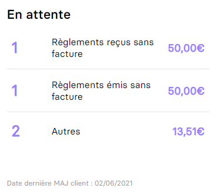
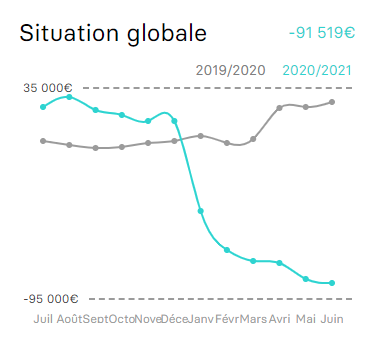

# Endpoints MCF

API pour récupérer les informations des dashboards et widgets.

# customer_waiting_account/widget



```bash
$ curl --location --request GET 'https://app.myunisoft.fr/api/v1/customer_waiting_account/widget' \
--header 'X-Third-Party-Secret: {{X_PARTY_SECRET}}' \
--header 'Authorization: Bearer {{API_TOKEN}}'
```

Si le retour est un tableau vide `[]` c'est qu'il n'y a encore aucune informations (nous allons certainement refactoriser cela).

Dans le cas contraire le JSON retourné ressemble à ceci:

```json
{
    "sum_payment_issued": 50,
    "nbr_payment_issued": 1,

    "sum_payment_received": 50,
    "nbr_payment_received": 1,

    "sum_others": 13.51,
    "nbr_others": 2,

    "last_update":"2021-06-02T11:17:37"
}
```

# dashboard

```bash
curl --location --request GET 'https://app.myunisoft.fr/api/v1/dashboard?application_type=Web&exercice_id=1345' \
--header 'X-Third-Party-Secret: {{X_PARTY_SECRET}}' \
--header 'Authorization: Bearer {{API_TOKEN}}'
```

> Note: il est nécessaire de fournir l'id d'un exercice. Voir la [documentation suivante](https://github.com/MyUnisoft/api-partenaires/blob/main/docs/exercices.md) pour récupérer la liste de tous les exercices d'un dossier de production.

La réponse ressemble au payload JSON suivant:
```json
{
    "id_config_user_dashboard": 1864,
    "cards_list": [
        {
            "id_card": 1,
            "type": "client",
            "year": []
        },
        {
            "id_card": 2,
            "type": "fournisseur",
            "year": []
        },
        {
            "id_card": 3,
            "type": "situation_globale",
            "year": []
        },
        {
            "id_card": 4,
            "type": "tresorerie",
            "year": []
        },
        {
            "id_card": 7,
            "type": "ca",
            "year": []
        }
    ]
}
```

Chaque objet contenu au sein de **cards_list** représente un dashboard. La clé `type` permet d'identifier le bon dashboard.

Par exemple ici `situation_globale`:



```json
{
    "id_card": 3,
    "type": "situation_globale",
    "year": [
        {
            "id": "EX",
            "label": "EX",
            "AN": true,
            "start_date": "2020-01-01",
            "end_date": "2020-12-31",
            "total": -211,
            "data": [
                {
                    "x": "Janv",
                    "y": -491,
                    "z": "202001"
                },
                {
                    "x": "Févr",
                    "y": -491,
                    "z": "202002"
                },
                {
                    "x": "Mars",
                    "y": -491,
                    "z": "202003"
                },
                {
                    "x": "Avri",
                    "y": -491,
                    "z": "202004"
                },
                {
                    "x": "Mai",
                    "y": -491,
                    "z": "202005"
                },
                {
                    "x": "Juin",
                    "y": -491,
                    "z": "202006"
                },
                {
                    "x": "Juil",
                    "y": -491,
                    "z": "202007"
                },
                {
                    "x": "Août",
                    "y": -491,
                    "z": "202008"
                },
                {
                    "x": "Sept",
                    "y": -491,
                    "z": "202009"
                },
                {
                    "x": "Octo",
                    "y": -491,
                    "z": "202010"
                },
                {
                    "x": "Nove",
                    "y": -491,
                    "z": "202011"
                },
                {
                    "x": "Déce",
                    "y": -211,
                    "z": "202012"
                }
            ]
        },
        {
            "id": "EX-1",
            "label": "EX-1",
            "AN": false,
            "start_date": "2019-10-01",
            "end_date": "2020-09-30",
            "total": -6071.12,
            "data": [
                {
                    "x": "Octo",
                    "y": 0,
                    "z": "201910"
                },
                {
                    "x": "Nove",
                    "y": -68.09,
                    "z": "201911"
                },
                {
                    "x": "Déce",
                    "y": -701.7,
                    "z": "201912"
                },
                {
                    "x": "Janv",
                    "y": -2055.4,
                    "z": "202001"
                },
                {
                    "x": "Févr",
                    "y": -3366.5,
                    "z": "202002"
                },
                {
                    "x": "Mars",
                    "y": -4471.39,
                    "z": "202003"
                },
                {
                    "x": "Avri",
                    "y": -5384.99,
                    "z": "202004"
                },
                {
                    "x": "Mai",
                    "y": -5649.26,
                    "z": "202005"
                },
                {
                    "x": "Juin",
                    "y": -5975.18,
                    "z": "202006"
                },
                {
                    "x": "Juil",
                    "y": -6007.16,
                    "z": "202007"
                },
                {
                    "x": "Août",
                    "y": -6039.14,
                    "z": "202008"
                },
                {
                    "x": "Sept",
                    "y": -6071.12,
                    "z": "202009"
                }
            ]
        }
    ]
}
```