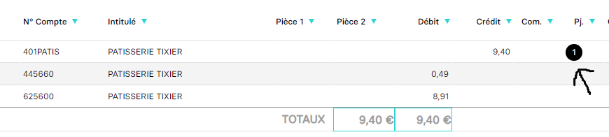
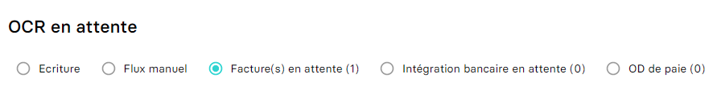

# Attacher une pièce jointe à une entrée comptable existante
Ce guide a pour objectif de vous aider dans l'ajout (upload) d'une pièce jointe sur une écriture comptable déjà existante. C'est une approche qui peut être nécessaire dans plusieurs situations:

- Combiner avec un import au format JSON (pour éviter de charger en mémoire l'intégralité du fichier).
- Vous permettre plus de flexibilité dans la gestion de la pièce jointe (si vous avez par exemple un système en deux temps).
- Permettre de revenir plus tard pour un ajout ou une correction.

Dans MyUnisoft les pièces jointes sont visibles à gauche (sur la saisie). À noter que leur présence sur la première ligne ne leur donne pas particulièrement d'affiliation avec la ligne elle-même (elles sont bien souvent en lien avec l'écriture elle-même).



Effectuer un clic sur la bulle noire vous ouvrira une nouvelle page navigateur avec un rendu de la pièce.

## API

La route https://api.myunisoft.fr/api/v1/document/add_all_types permets d'envoyer une pièce jointe sur une écriture précise.

```bash
curl --location --request POST 'https://api.myunisoft.fr/api/v1/document/add_all_types?location=ENTRIES&object_id=79985373&filename_extension=note%20de%20frais%20manuel.JPG&type_result=1' \
--header 'X-Third-Party-Secret: {{X-Third-Party-Secret}}' \
--header 'Content-Type: application/octet-stream' \
--header 'Authorization: Bearer {{API_TOKEN}}'
```

Les paramètres (URL) de la route sont les suivants:

| clé | description |
| --- | --- |
| location | Le type de l'entrée, **ENTRIES** ou **ENTRIES_TEMP** |
| object_id | l'id de l'entrée comptable sur laquelle nous souhaitons ajouter la pièce |
| filename_extension | le nom du fichier avec l'extension |
| type_result | laisser la valeur 1 |

### Location

Dans MyUnisoft la location correspond à la catégorie de la saisie



- ENTRIES = **Ecriture**
- ENTRIES_TEMP = **Facture(s) en attente**

### Récupération d'une écriture

Pour récupérer l'id d'une écriture les guides suivants pourront probablement vous aider;
- [Par l'endpoint de récupération des écritures comptables](https://github.com/MyUnisoft/api-partenaires/blob/main/docs/ecritures.md)
- [Par l'ID partenaire](https://github.com/MyUnisoft/api-partenaires/blob/main/docs/entry_json.md#gestion-dun-id-partenaire)