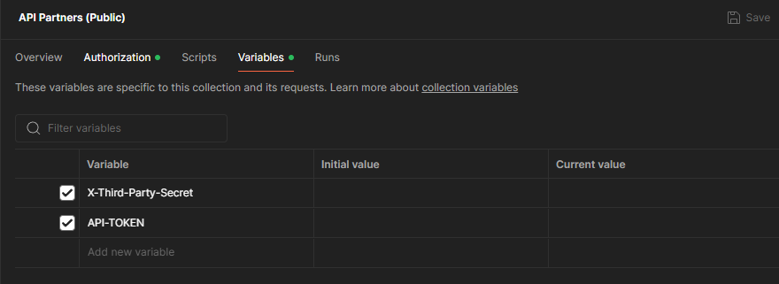

---
prev:
  text: 🐤 Introduction
  link: documentation.md
next: false
---

# Postman
Collection postman correspondant à celle disponible [en ligne](https://docs.api.myunisoft.fr/#intro). Aussi accessible directement par la navigation tout en haut.

- <a href="https://github.com/MyUnisoft/api-partenaires/blob/main/docs/postman/API%20Partners%20(Public).postman_collection.json" target="_blank">API Partners (Public).postman_collection.json</a>

## Variables

La collection vous permet de renseigner la clé secrète et un jeton généré (à partir du front-end en suivant nos guides d'authentification).

> [!NOTE]
> N'hésitez pas à nous faire des retours en cas de problèmes.
